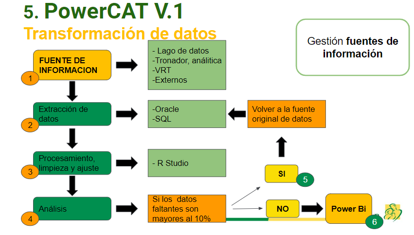
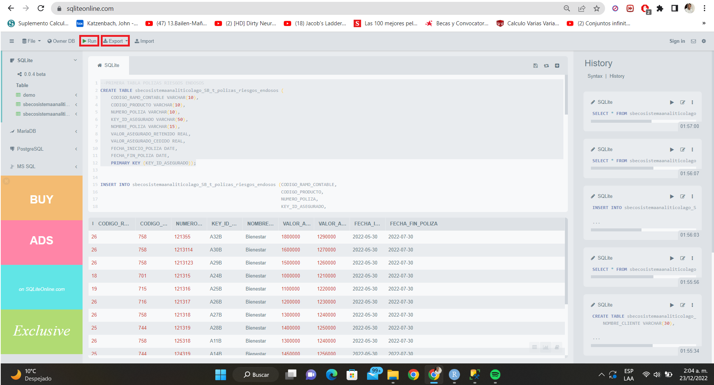
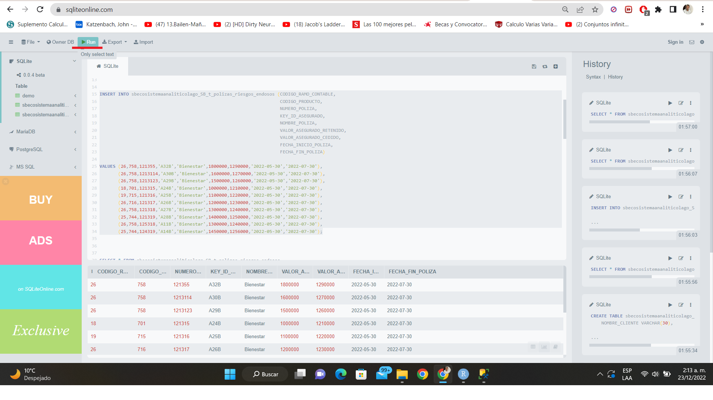
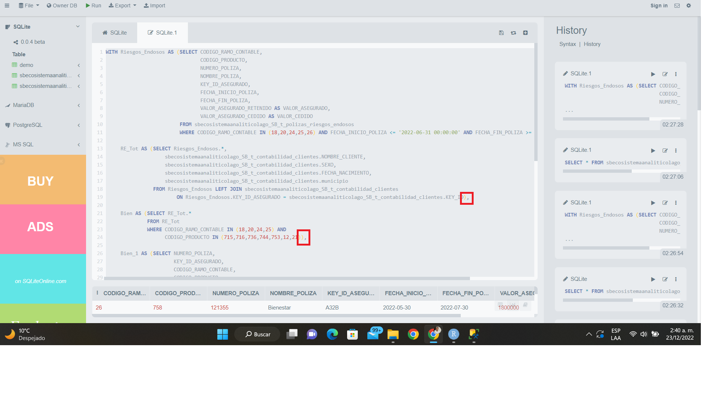
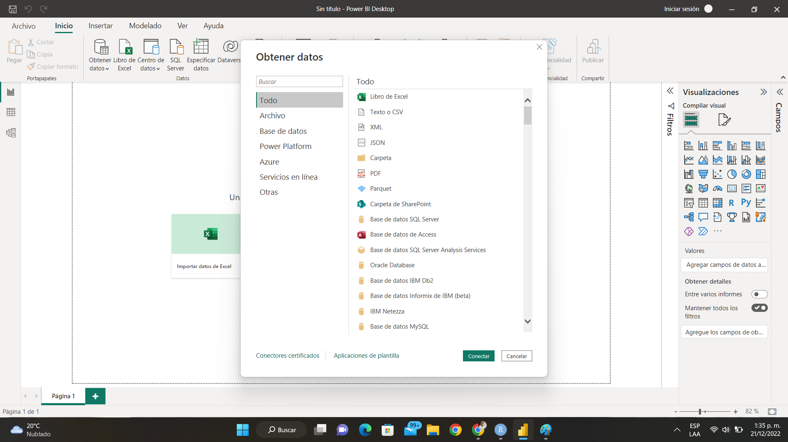
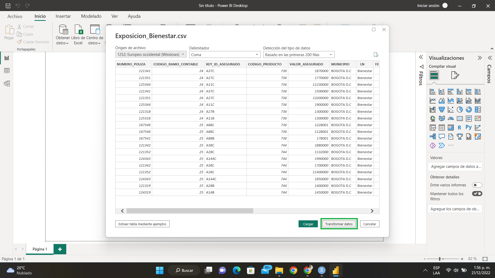
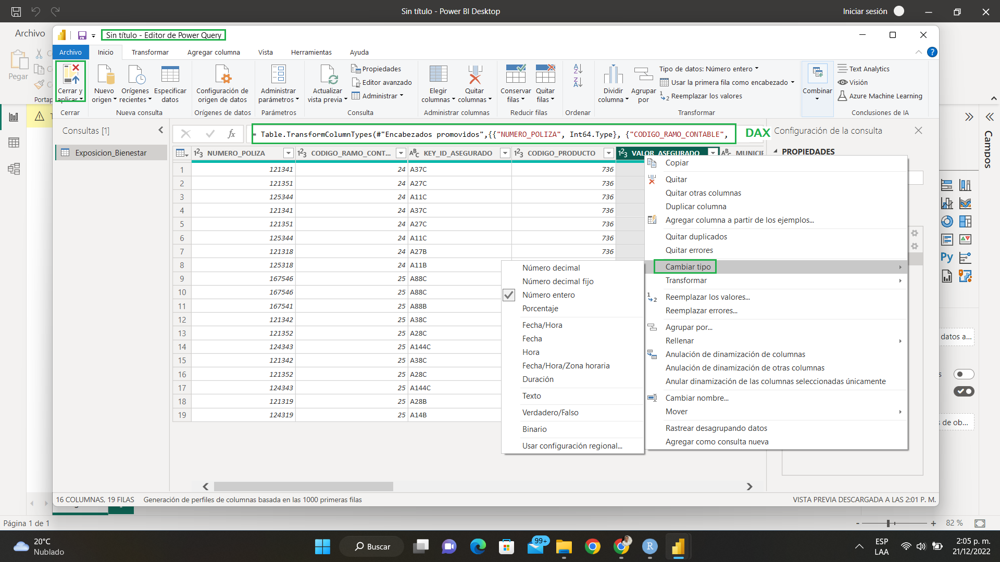
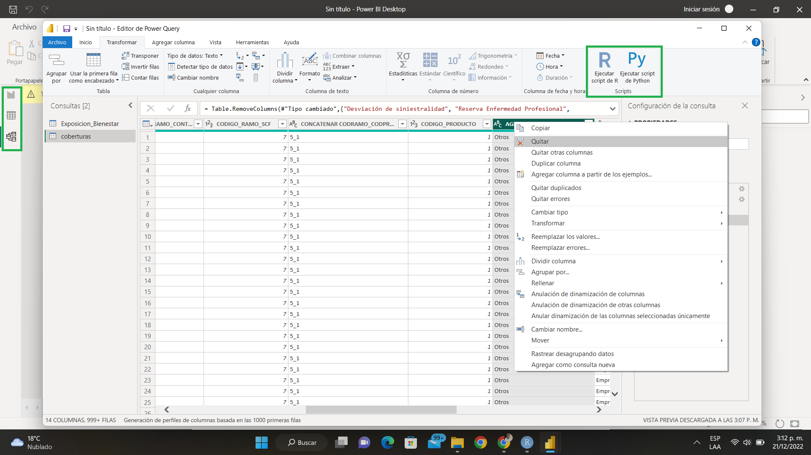
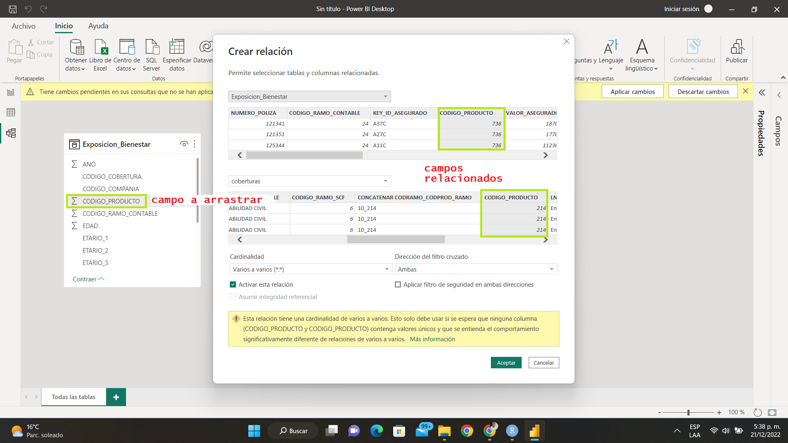
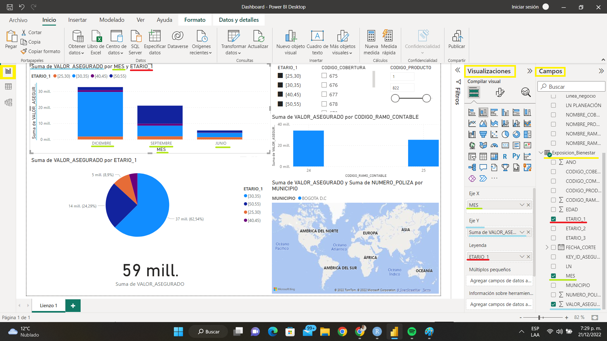

```{r setup, include=FALSE}
knitr::opts_chunk$set(echo = TRUE)
```

## **Introducción**
### Resumen

“El análisis de datos es la ciencia que se encarga de examinar un conjunto de datos con el objetivo de evidenciar: fenómenos, comportamientos y conclusiones, sobre la información recolectada para poder tomar decisiones, implementar estrategias , o simplemente ampliar los conocimientos sobre diversos temas de interés.”
 
Se describe la monografía como el ejercicio de realizar una  aproximación y en ciertos casos dar solución a un problema de investigación o innovación en un campo de conocimiento,  mediante la selección de referentes teóricos, la recopilación, análisis crítico y sistematización de información relevante.
 
La intención de este trabajo de grado en modalidad de monografía es realizar, mediante una metodología guiada un ejercicio exploratorio de aproximación al campo matemático profesional del análisis de datos, aplicando los conocimientos adquiridos a través del proceso de formación que proporciona la carrera de matemáticas, con el fin de acortar las brechas entre la formación académica universitaria y el desarrollo de la vida profesional, dirigida al público en general y especialmente a todos los que han generado un aprecio y desarrollo en las matemáticas.
 
Permitiendo así acercar a los estudiantes a la vida profesional, dándoles a conocer una opción de carrera donde puedan desarrollarse plenamente como matemáticos y a su vez aporten al desarrollo tecnológico y científico del país, aportando a diferentes áreas del análisis de datos todo su potencial científico.
 
Hasta hace unas pocas y cercanas generaciones de graduados en matemáticas, se tenía como principal y casi único campo de acción: la educación, paradigma que aún resuena y empieza a cambiar. Con el tiempo, el avance de la ciencia y la tecnología, se han desarrollado diferentes herramientas cada vez más capaces y eficientes en cuanto a la solución y optimización de diversas "situaciones problema", esta evolución requiere del conocimiento de diferentes áreas a profundidad, el estudio, manejo y el poder innovar en estas áreas es trabajo de científicos e ingenieros.
 
Entiéndase por herramientas informáticas como el conjunto de aplicaciones que ayudan a gestionar información por medio de la computadora como el procesador de texto, graficadores, bases de datos,  correo electrónico, hojas de cálculo, etc, para este trabajo como tal se utilizaron selectivos programas, los cuales tienen como función mediante pasos lógicos cumplir una tarea en específico en este lo referido al manejo de grandes volúmenes de información.
 
 
El análisis de datos es una de estas ciencias, creadas de la fusión y la evolución del fenómeno de necesidad entre ciencias e ingenierías, áreas como: las matemáticas, ingeniería de sistemas, economía, son el origen y fuerza motor del análisis de datos. 
 
El aporte de conocimientos matemáticos y sus características son pilares fundamentales de alto valor para el desarrollo de este campo.
 
 
Tuve la oportunidad de tener una experiencia profesional en Seguros Bolívar donde tuve la guía y acompañamiento de diferentes profesionales enfocados en el análisis de datos referentes al análisis de riesgo y fraude que se evidencia en esta compañía.
 
El análisis de datos en acción requiere para su entendimiento y desarrollo, un amplio y legítimo conocimiento en matemáticas, teniendo en cuenta que gracias a lo cursado en este pregrado he desarrollado las autopistas y estructuras mentales óptimas para  este tipo de trabajos, donde se requiere la investigación, el análisis, la capacidad de desarrollar estrategias, de abstraer situaciones problema desde la interpretación matemática, la construcción e implementación de modelos matemáticos para abordar el análisis y solución de problemas en la situación requerida, y demás habilidades adquiridas en el pregrado en matemáticas.
 
El análisis de datos es una nueva tendencia a nivel global y un campo en exploración en constante innovación, más aún en Colombia donde sus orígenes son tan recientes, donde hay mucho por investigar y desarrollar. 
 
El cargo como tal será “asistente de analista de datos” en el área de actuaría conocida como la vertical de riesgo técnico (VRT), se estudiarán lenguajes de programación como R, SQL y POWER BI; los cuales serán implementados en diferentes momentos del proceso en cuestión,
 
El manejo de estas herramientas tiene como fin evidenciar y reconocer sus funciones, sus procesos y principalmente sus resultados, con el objetivo de desarrollar un análisis y poder dar un aporte a nivel profesional de los resultados adquiridos de esta rutina, con el objetivo final de ser registrados y   Acá falta algo como 
 
RECONOCER LAS HERRAMIENTAS INFORMÁTICAS Y SU PAPEL EN LA RUTINA, CON EL FIN DE ESTUDIAR LAS FUNCIONES MÁS EFICIENTES Y EMPLEADAS EN EL ANÁLISIS DE DATOS, PARA QUE QUEDE SU MANEJO A CRITERIO DE CADA LECTOR.

{with=100%}


### Palabras claves: 

Análisis de datos, consultas, bases de datos, variables o columnas, registros, vectores, matrices, dashboard, visualizaciones.

### Objetivos:

- Desarrollarme personal y profesionalmente en un espacio de trabajo de mi interés, el análisis de datos, como próximo profesional en matemáticas. Ejecutar las tareas asignadas por el área laboral.

- Identificar y reconocer nuevos lenguajes de programación con el fin de generar resultados propios.

- Entender y estudiar las rutinas planteadas por el área de trabajo con el fin de generar seguridad en temas referentes al análisis de datos.

- Reconocer e intervenir áreas donde puedo aportar de manera constructiva con el conocimiento matemático adquirido en el pregrado, generando así desarrollo en el área de trabajo.

## **Consulta de datos con SQL**

Antes de empezar a entrar en materia podría ser beneficioso presentar algunos conceptos básicos de bases de datos, almacenamiento y computarización.

Un **database** (base de datos) no es más que un conjunto de información relacionada. Como lo puede ser un directorio telefónico donde se almacenan los datos o registros de diferentes variables como nombres, números y direcciones de cierto grupo de residentes.

Debido a lo ineficiente que es tener las bases de datos en papel, ya sea por la búsqueda de registros, la eliminación, actualización o edición de estos, algunas de las primeras aplicaciones informáticas en la década de los 80's eran sistemas de bases de datos, mecanismos computarizados que permiten almacenar, recuperar, eliminar o en si manipular conjuntos de datos.

Structured Query Language (SQL) es un **lenguaje estructurado declarativo** de consultas para bases de datos relacionales, creado por IBM, para acceder a las bases de datos almacenadas en un ordenador o servidor, las solicitudes se le hacen al ordenador mediante sentencias o declaraciones de código y este  genera la consulta, la cual interactúa con la base de datos, capturando la información requerida a conveniencia, a su vez permite mediante declaraciones realizar diversos tipos de operaciones sobre estas. 


#### Clases de comandos SQL

Los tipos de comandos en SQL se agrupan en dos categorías de datos **DDL Data Definition Language** referido a la creación de relaciones (tablas), extracción y operaciones de datos, y el **DML Data Manipulation Language** referido a la manipulación, orden y edición de registros en las tablas, siendo estos lenguajes de código capaces de conjugar operaciones de álgebra y cálculo relacional junto con operadores adicionales.

Para todo ello se requiere un sistema gestor de base de datos (SGBD) el cual interactúa entre el ordenador y la base de datos, ejemplos de estos están Access, SQLServer, Oracle y el tratado en este trabajo mySQL, los cuales tienen en común el estándar SQL como lenguaje de programación de consulta.

**Data Definition Language (DDL)**: 
Utilizados para selección y creación de tablas o bases de datos, realizar consultas o eliminar bases de datos.
Comandos: **SELECT, INSERT, UPDATE, DELETE.**

**Data Manipulation Language (DML)**: 
Utilizados para crear, eliminar y modificar la estructura de una base de datos, ejemplos como eliminar un campo o agregar un campo.  
Comandos: **CREATE, ALTER, DROP, TRUNCATE.**

**Data Control Language (DCL)**: 
Utilizados para brindar seguridad y acceso a datos de una base de datos en una consulta. 
Comandos: **GRANT, REVOKE.**

**Transaction Control Language (TCL)**: 
Utilizados para la gestión de datos.   
Comandos: **COMMIT, ROLLBACK, SAVEPOINT.**

#### Cláusulas:

Cada instrucción en SQL tiene cláusulas. Cada cláusula realiza una función de la instrucción SQL, son condiciones de modificación cuyo objetivo es definir los datos que se desean seleccionar o manipular. En la siguiente tabla, se exponen las cláusulas SQL más comunes.

| Cláusula          | Función     | 
|:-------------------|:-------------|
| FROM              | Especifica la tabla de la cual se van a obtener los registros  | 
| WHERE             | Especifica las condiciones o criterios de los registros seleccionados mediante el FROM   | 
| HAVING            | Especifica las condiciones o criterios que deben cumplir los grupos | 
| ORDER BY          | Ordena los registros seleccionados de acuerdo a especificaciones  |
| GROUP BY          | Utilizada para separar los registros seleccionados en grupos específicos  |


Una **INSTRUCCIÓN en SQL** que permite obtener información de una base de datos o modificar la información que hay una base de datos, es simplemente la concatenación de:

INSTRUCCIÓN EN SQL:    **COMANDO + CLÁUSULAS + OPERADORES + FUNCIONES**    

COMO MÍNIMO:           **COMANDO + CLÁUSULA**

**COMANDOS Y SENTENCIAS**

##### Create table

Un ejemplo sencillo y básico de una **INSTRUCCIÓN en SQL** es crear una nueva tabla mediante el comando **CREATE TABLE**, donde dentro del argumento (paréntesis) definimos las variables (columnas) que emplearemos, seguido a esto el proceso para agregar datos a la tabla se da mediante el comando **INSERT.**

El modelo más simple para crear una tabla es:

```{sql, eval=FALSE}
CREATE TABLE tabla (
  definición de columnas o variables,
  claves y restricciones
);
```

##### Variables y restricciones

Definición de columnas o variables: 
Básicamente es asignar un nombre a las columnas (variables) a manejar y asignar qué tipo de variable es, entre los diferentes tipos de variables se encuentran:

- CHAR(n) Cadenas longitud fija hasta n caracteres.
- VARCHAR(n) Cadenas longitud variable hasta n caracteres.
- INTEGER, BIGINT, SMALLINT... Numeros Enteros.
- REAL... Número real.
- DATE... Fechas compuestas de: YEAR, MONTH y DAY.
- TIME... Horas. Están compuestas de HOUR, MINUTE y SECOND.

Marcadores y restricciones:

- AUTO INCREMENT - Autonumérico, secuencial que va asignando el entero siguiente.
- DEFAULT val - Establece un valor por defecto al campo.
- NOT NULL - No puede contener valores nulos.
- PRIMARY KEY - El campo es la clave primaria no compuesta.
- REFERENCES tabla(campo) - Clave ajena no compuesta.
- CHECK (cond.) - El campo debe cumplir una condición

Para dar una muestra de cómo estas instrucciones se ejecutan, habrá secciones de código SQL ejemplificando. La instrucción de código para crear la tabla "PRODUCTOS" en SQL es:

```{sql, eval=FALSE}
CREATE TABLE PRODUCTOS (
    codigo_producto INTEGER,
    nombre_producto VARCHAR(20) UNIQUE NOT NULL,
    tipo VARCHAR(20),
    descripcion VARCHAR(50),
    precio REAL DEFAULT 1.0,
    fabrica INTEGER DEFAULT NULL,
    PRIMARY KEY (codigo_producto),
    CONSTRAINT precio CHECK (precio>5));
```
Esta instrucción crea una tabla llamada "PRODUCTOS" con seis variables o columnas:  
"codigo_producto" como entrada entero, "nombre_producto"  como serie de caracteres, en este caso con un límite de 20 de ellos de tipo único y no vacío, "precio" como número real que de no tener valor será asignado 1.0 por defecto, "fabrica" como entero por defecto nulo.   

**PRIMARY KEY(codigo_producto)** hace referencia a identificar de manera única el código produto denegando el registro de dos o más productos con el mismo "codigo_producto". 

**CONSTRAINT** es usado para especificar reglas en una tabla en este caso junto con **CHECK** La variable "precio" adquiere la condición de que su valor debe de ser mayor a 5 para permitir su registro.

##### insert value 

A continuación tenemos la instrucción para insertar una fila de registro en la tabla "PRODUCTOS". Para ello se utiliza el comando **INSERT** referido a insertar, **INTO** dentro, de la tabla "PRODUCTOS", luego el argumento contiene las variables (columnas) a las que adicionamos el registro (codigo_producto,nombre_producto,tipo,
descripción, precio,fabrica), y posteriormente mediante **VALUE** damos los valores que tendrán dichas variables para el registro a adicionar (20, 'Maicol company','maleta','bonita',2000,1) y (30, 'Maicol scopany','gorra','fea',3000,2).


```{sql, eval=FALSE}
INSERT INTO PRODUCTOS (codigo_producto,nombre_producto,tipo,descripcion,precio,fabrica)
VALUES (20, 'Maicol company','maleta','bonita',2000,1);

INSERT INTO PRODUCTOS (codigo_producto,nombre_producto,tipo,descripcion,precio,fabrica)
VALUES (30, 'Maicol scopany','gorra','fea',3000,2);
```

Finalmente, mediante los comandos **SELECT** concatenado con el comando **FROM** mediante el * se podrá evidenciar la tabla recién creada.

```{sql, eval=FALSE}
SELECT * FROM PRODUCTOS
```
Al ejecutar este código obtenemos como resultado la impresión de la tabla "PRODUCTOS" junto con los registros adicionados.

| codigo_producto|nombre_producto|tipo|descripcion|precio | fabrica |
| :-------: | :------: | :------: | :------:| :----:|:-----:|
| 20| Maicol company|maleta|bonita|2000|1|
| 30| Maicol scopany|gorra|fea|3000|2|

A su vez, mediante el comando **SELECT** podemos seleccionar el valor para la variable "fabrica", de la tabla "PRODUCTOS" mediante **FROM**, con el comando condicionante **WHERE**, donde el registro de la variable "tipo" sea igual a 'maleta'.

Imprimiendo así "fabrica" = 2.

```{sql, eval=FALSE}
SELECT fabrica
  FROM PRODUCTOS
  WHERE tipo = 'maleta';
```

Obteniendo como resultado

| fabrica |     
|:----------|
| 1  |

##### left join

Un importante caso a resaltar es el de concatenación o cruce de tablas mediante el comando **LEFT JOIN**, en el siguiente ejemplo tenemos las tablas "ALUMNOS" y "CARRERAS" las cuales concatenamos mediante la variable "id_carrera" que se encuentra en ambas tablas.

Concatenamos a la izquierda de la tabla "CARRERAS" la tabla "ALUMNOS" mediante la variable llave "id_carrera" de la tabla "CARRERAS" y la variable llave "id_carrera" de la tabla "ALUMNO". Que la variable se encuentre en ambas tablas es una coincidencia bien se pudo concatenar de igual manera sin que la variable de alguna de ambas tablas se llamará "id_carrera" pues pudo ser "cod_carrera" pero al tener los mismos valores, se concatenaría de igual manera.

Tabla ALUMNOS:

| codigo_alumno |nombre_alumno |id_carrera|
| :-------: | :------: | :------: |
| 1213| Maicol fuentes|1|
| 1214| Dido perez |1|
| 1215| Luisa roa |2|
| 1216| Jhon rua|3|
| 1217| Juan roa|3|

Tabla CARRERAS:

| id_carrera | carrera |
| :-------: | :------: |
| 1| mates |
| 2| literatura|
| 3| astronauta|

Mediante la siguiente sentencia

```{sql, eval=FALSE}
SELECT * FROM ALUMNOS LEFT JOIN CARRERAS ON CARRERAS.id_carrera = ALUMNOS.id_carrera
```
Obtenemos la tabla resultado

| codigo_alumno |nombre_alumno |id_carrera| id_carrera | carrera |
| :-------: | :------: | :------: | :-------: | :------: |
| 1213| Maicol fuentes|1| 1| mates |
| 1214| Dido perez |1| 1| mates |
| 1215| Luisa roa |2| 2| literatura|
| 1216| Jhon rua|3| 3| astronauta|
| 1217| Juan roa|3| 3| astronauta|


#### **PRÁCTICA**

Como ejercicio práctico se expondrá el manejo que tiene la compañía Seguros Bolívar para el manejo de datos respecto a pólizas y valores asegurados, permitiendo evidenciar un contexto real de cómo se emplean estas rutinas en el campo laboral.

Seguros Bolívar divide en grandes conjuntos sus pólizas, en primera instancia las pólizas son agrupadas en líneas de negocio, ejemplo de estas son Seguros de vida, Vivienda, Automóviles, Empresas entre otras. A su vez estas líneas de negocio se dividen en Ramos, estos son los menores y más específicos conjuntos de pólizas. El objetivo de esta práctica es tener un control y conocimiento del valor y la cantidad de pólizas que se están vendiendo, reconocer sus compradores y el valor asegurado de cada una de ellas.

Para empezar, Seguros Bolívar cuenta con un sistema de lago de datos (MAGDA) almacenado en la nube de Google Cloud Platform, donde se cargan todos los registros y datos referidos a las transacciones y demás necesidades de la compañía. Este lago de datos es alimentado mes a mes por las diferentes áreas de la compañía, allí se encuentran los datos empleados en esta práctica, referidos a información de las pólizas como nombre, código, ramo al que pertenece y valor, a su vez por cuanto costo y a qué persona se le asignan, que son recolectados específicamente de las tablas “t.polizas.riesgos.endosos” y “t.contactabilidad.clientes”. Cloud SQL es un gestor de bases de datos que permite configurar, mantener y administrar tus bases de datos relacionales en Google Cloud Platform mediante código SQL.

En este caso el comando **WITH** nos permite generar la tabla "Riesgos_Endosos" seleccionando y restringiendo algunos datos extraídos de la tabla 'sbecosistemaanaliticolago_SB_t_polizas_riesgos_endosos', esta tabla "Riesgos_Endosos" cruzada con registros seleccionados de la tabla "sbecosistemaanaliticolago_SB_t_contabilidad_clientes" crea la tabla "RE_Tot", de esta última tabla se filtran registros de "CODIGO_RAMO_CONTABLE" y "CODIGO_PRODUCTO" creando así la tabla "Bien"y así generando la siguiente tabla, esta es la cualidad que buscamos del comando **WITH** poder generar una serie de sub consultas sin necesidad de almacenarlas todas, sino únicamente su resultado final.

**IMPORTANTE RECOMENDACIÓN**

Para correr las siguientes rutinas se le recomienda al lector, ya sea crear las tablas requeridas o descargarlas de GitHub:

1. Correr el siguiente código el cual crea las tablas "sbecosistemaanaliticolago_SB_t_polizas_riesgos_endosos" y "sbecosistemaanaliticolago_SB_t_contabilidad_clientes" en la página https://sqliteonline.com/ y proceder a exportarlas, para su creación siga los pasos a continuación:

```{sql, eval=FALSE}
--PRIMERA TABLA POLIZAS RIESGOS ENDOSOS
CREATE TABLE sbecosistemaanaliticolago_SB_t_polizas_riesgos_endosos (
    CODIGO_RAMO_CONTABLE VARCHAR(10),
    CODIGO_PRODUCTO VARCHAR(10),
    NUMERO_POLIZA VARCHAR(10),
    KEY_ID_ASEGURADO VARCHAR(50),
	NOMBRE_POLIZA VARCHAR(15),
    VALOR_ASEGURADO_RETENIDO REAL,
    VALOR_ASEGURADO_CEDIDO REAL,
  	FECHA_INICIO_POLIZA DATE,
  	FECHA_FIN_POLIZA DATE,
    PRIMARY KEY (KEY_ID_ASEGURADO));


INSERT INTO sbecosistemaanaliticolago_SB_t_polizas_riesgos_endosos (CODIGO_RAMO_CONTABLE,
																	CODIGO_PRODUCTO,
																	NUMERO_POLIZA,
																	KEY_ID_ASEGURADO,
																	NOMBRE_POLIZA,
																	VALOR_ASEGURADO_RETENIDO,
																	VALOR_ASEGURADO_CEDIDO,
  																	FECHA_INICIO_POLIZA,
  																	FECHA_FIN_POLIZA)

VALUES (20,758,121355,'A32B','Bienestar',1800000,1290000,'2022-05-30','2022-07-30'),
       (18,540,1213114,'A30B','Bienestar',1600000,1270000,'2022-05-30','2022-07-30'),
	   (26,758,1213123,'A29B','Bienestar',1500000,1260000,'2022-05-30','2022-07-30'),
	   (18,541,121315,'A24B','Bienestar',1000000,1210000,'2022-05-30','2022-07-30'),
	   (19,715,121316,'A79B','Bienestar',1100000,1220000,'2022-05-30','2022-07-30'),
       (24,727,121317,'A26B','Bienestar',1200000,1230000,'2022-05-30','2022-07-30'),
	   (20,712,121318,'A27B','Bienestar',1300000,1240000,'2022-05-30','2022-07-30'),
	   (25,737,121319,'A28B','Bienestar',1400000,1250000,'2022-05-30','2022-07-30'),
	   (26,758,125318,'A11B','Bienestar',1300000,1240000,'2022-05-30','2022-07-30'),
	   (24,500,124319,'A14B','Bienestar',1450000,1256000,'2022-05-30','2022-07-30');


SELECT * FROM sbecosistemaanaliticolago_SB_t_polizas_riesgos_endosos


--SEGUNDA TABLA CLIENTES

CREATE TABLE sbecosistemaanaliticolago_SB_t_contabilidad_clientes (
    NOMBRE_CLIENTE VARCHAR(30),
    SEXO VARCHAR(10),
    FECHA_NACIMIENTO DATE,
    MUNICIPIO VARCHAR(50),
	KEY_ID VARCHAR(20),
    PRIMARY KEY (KEY_ID));
    
SELECT * FROM sbecosistemaanaliticolago_SB_t_contabilidad_clientes

INSERT INTO sbecosistemaanaliticolago_SB_t_contabilidad_clientes (NOMBRE_CLIENTE ,
    															  SEXO,
    															  FECHA_NACIMIENTO,
   																  MUNICIPIO,
														      KEY_ID)

VALUES ('DANIEL ROA','MASCULINO','1989-12-30','Bogotá','A32B'),
	   ('JUAN ROA','MASCULINO','1980-11-28','Bogotá','A24B'),
       ('LAURA MARIA','FEMENINO','1979-08-07','Bogotá','A26B'),
       ('CAROLINA GOMEZ','FEMENINO','1996-10-23','Bogotá','A14B'),
       ('NICOLAS MORALES','MASCULINO','1978-03-13','Bogotá','A37B'),
       ('PEDRO GOMEZ','MASCULINO','1969-05-24','Bogotá','A11B'),
       ('PEPE GARCIA','MASCULINO','1989-10-24','Bogotá','A28B'),
       ('PAOLA PUERTAS','FEMENINO','1999-10-24','Bogotá','A40B'),
       ('ANDREA TORRES','FEMENINO','1991-12-12','Bogotá','A25B'),
       ('CAMILO CASTAÑEDA','MASCULINO','1985-07-15','Bogotá','A29B'),
       ('LAURA FLORIAN','FEMENINO','1997-05-10','Bogotá','A27B'),
       ('RAUL DUARTE','MASCULINO','1995-07-15','Bogotá','A30B'),
       ('MARIO ROA','MASCULINO','1987-11-01','Bogotá','A79B');
       
SELECT * FROM sbecosistemaanaliticolago_SB_t_contabilidad_clientes
```

2. Los códigos se corren seleccionando (marcando) todo el bloque de código a correr y haciendo clic en el botón superior "run". Acá un ejemplo de como correr el primer comando "CREATE TABLE".



Ya creada la tabla "sbecosistemaanaliticolago_SB_t_polizas_riesgos_endosos" procedemos a insertarle los valores.

3. Correr el código en el siguiente orden, primero la sección **CREATE TABLE**, segundo correr al tiempo la sección del comando "INSERT VALUES" junto con la sección "VALUES".



4. Repetir análogamente el proceso para construir la tabla "sbecosistemaanaliticolago_SB_t_contabilidad_clientes".

5. Para descargar una base de datos, seleccione y corra el código ```"sb-ecosistemaanalitico-lago.seguros_bolivar.t_polizas_riesgos_endosos"``` y de clic en exportar, recuerde cambiar el nombre de las bases de datos esportadas.

**Si el lector bien desea, puede abrir otra pestaña y correr la rutina de la práctica SQL en la misma página https://sqliteonline.com/ o en su defecto desde su propio programa local**

**RECUERDE TODAS LAS SECCIONES DEL CÓDIGO WITH() DE LA RUTINA PRÁCTICA DEBEN IR SEGUIDAS EN EL MISMO SCRIPT Y SEPARADAS POR COMAS TAL COMO VIENE EN LAS SECCIONES DE CÓDIGO, ACÁ UNA VISUALIZACIÓN PARA EVITAR CONFUSIONES**



**DESCARGA DE GITHUB**

Para la base clientes: https://raw.githubusercontent.com/daniereyes96/RecHerrDataAnalyst/main/SQL/sbecosistemaanaliticolago_SB_t_contabilidad_clientes.csv 
Para la base Riesgos endosos: https://raw.githubusercontent.com/daniereyes96/RecHerrDataAnalyst/main/SQL/sbecosistemaanaliticolago_SB_t_polizas_riesgos_endosos.csv

**ESTE TRABAJO REQUIERE ATENCIÓN AL DETALLE**

Recuerde descargar las bases en formato ".csv" y cambiar los nombres "sbecosistemaanaliticolago_SB_t_contabilidad_clientes" y "sb-ecosistemaanalitico-lago.seguros_bolivar.t_polizas_riesgos_endosos".

**IMPORTANTE: AL MOMENTO DE EJECUTAR LA RUTINA, TODAS LAS SECCIONES DE CÓDIGO DEBEN ESTAR EN EL MISMO SCRIPT Y SEPARADAS POR COMAS, DE HECHO LAS COMAS YA ESTÁN INCLUIDAS EN LAS SECCIONES DE CÓDIGO.**

El código a continuación permite extraer una matriz con los datos de interés, donde se distingue primero las diferentes variables como las descritas a continuación:

- Con la cláusula **WITH** se pueden generar una o más subconsultas, cada subconsulta genera una tabla temporal, tabla que se utilizará de manera recursiva para la creación de una siguiente tabla, mejorando el rendimiento de la consulta.

- Acá se evidencia la primera tabla creada en el **WITH** "Riesgos_Endosos" como la subconsulta que se define mediante el **SELECT**, que rescata las variables de información de las pólizas, sus valores, códigos, a qué ramo pertenecen entre otros detalles manejados por la compañía.
- Se cambia el nombre de la variable "VALOR_ASEGURADO_RETENIDO" a  "VALOR_RETENIDO" con el comando **AS**.

- Mediante **FROM** se especifica la tabla de origen "sb-ecosistemaanalitico-lago.seguros_bolivar.t_polizas_riesgos_endosos" de donde se rescatan los datos que pidió el **SELECT**.

- Con el condicionante **WHERE** restringimos que solo se extraerán los datos **donde** la variable "CODIGO_RAMO_CONTABLE" sea igual a cualquiera de los siguientes valores **IN** (18,20,24,25,26,34), pues estos son los códigos de los ramos contables referidos a la línea de negocio Bienestar de la compañía.

- A su vez condicionamos que "FECHA_INICIO_POLIZA" sea antes de una fecha de preferencia, en este caso el segundo trimestre del año 2022 y que "FECHA_FIN_POLIZA" sea después de "2022-06-31".

- Por último se ordenarán las variables de esta tabla a antojo, mediante el comando **ORDER BY**.


```{sql, eval=FALSE}
WITH Riesgos_Endosos as (select CODIGO_RAMO_CONTABLE,
 								CODIGO_PRODUCTO,
      							NUMERO_POLIZA,
      							NOMBRE_POLIZA,
      							KEY_ID_ASEGURADO,
                         		FECHA_INICIO_POLIZA,
                         		FECHA_FIN_POLIZA,
      							VALOR_ASEGURADO_RETENIDO AS VALOR_ASEGURADO,
      							VALOR_ASEGURADO_CEDIDO AS VALOR_CEDIDO
                         FROM 'sbecosistemaanaliticolago_SB_t_polizas_riesgos_endosos'
                         WHERE CODIGO_RAMO_CONTABLE IN (18,20,24,25,26) 
                         AND FECHA_INICIO_POLIZA <= '2022-06-31 00:00:00' 
                         AND FECHA_FIN_POLIZA >= '2022-06-31 00:00:00'
						 ORDER BY CODIGO_RAMO_CONTABLE,NUMERO_POLIZA,KEY_ID_ASEGURADO),
```
Si se desea evidenciar el resultado de esta primera operación del **WITH** se debe poner el codigo ``` SELECT * FROM Riesgos_Endosos;``` justamente después del último paréntesis y quitando la coma que le siga a este.
Resultado:

| COD_RAMO_CONT |COD_PRTO|NUM_POLIZA| NOMBRE_POLIZA | KEY_ID_ASEGURADO | FECHA_INICIO_POLIZA | FECHA_FIN_POLIZA | VALOR_ASEGURADO | VALOR_CEDIDO |NOMBRE_CLIENTE| SEXO | FECHA_NACIMIENTO | MUNICIPIO
| :-------: | :------: | :------: | :-------: | :------: | :------: | :-------: | :------: |:------: |
|18|701|121315|Bienestar|A24B|2022-05-30|2022-07-30|1000000|1210000|
|20|716|121317|Bienestar|A26B|2022-05-30|2022-07-30|1200000|1230000|
|24|736|121318|Bienestar|A27B|2022-05-30|2022-07-30|1300000|1240000|
|24|736|125318|Bienestar|A11B|2022-05-30|2022-07-30|1300000|1240000|
|25|744|121319|Bienestar|A28B|2022-05-30|2022-07-30|1400000|1250000|
|25|744|124319|Bienestar|A14B|2022-05-30|2022-07-30|1450000|1256000|

- Continuando dentro del argumento del comando **WITH** se define a partir de la tabla anterior, la nueva tabla llamada "RE_Tot" referente a Riesgos Endosos Totales.

- Se selecciona mediante **SELECT** la tabla "Riesgos_Endosos" y las variables de "SEXO", "FECHA_NACIMIENTO","MUNICIPIO_DIRECCION_1" provenientes la tabla 'sb-ecosistemaanalitico-lago.golden_records.t_contabilidad_clientes'.

- Mediante el comando **FROM** se especifica la tabla "Riesgos_Endosos" y se unen a la izquierda los datos de la tabla 'sb-ecosistemaanalitico-lago.golden_records.t_contabilidad_clientes' previamente seleccionados con el comando **LEFT JOIN** y los concatena usando el **ON**, mediante los registros que coinciden para la variable "KEY_ID_ASEGURADO" en la tabla "Riesgos_Endosos" con los registros de la variable "KEY_ID" de la tabla 'sb-ecosistemaanalitico-lago.golden_records.t_contabilidad_clientes'.


```{sql, eval=FALSE}
     RE_Tot as (select Riesgos_Endosos.*,
                	sbecosistemaanaliticolago_SB_t_contabilidad_clientes.NOMBRE_CLIENTE,
                	sbecosistemaanaliticolago_SB_t_contabilidad_clientes.SEXO,
                	sbecosistemaanaliticolago_SB_t_contabilidad_clientes.FECHA_NACIMIENTO,
                	sbecosistemaanaliticolago_SB_t_contabilidad_clientes.MUNICIPIO
                FROM Riesgos_Endosos LEFT JOIN sbecosistemaanaliticolago_SB_t_contabilidad_clientes
               			ON Riesgos_Endosos.KEY_ID_ASEGURADO = sbecosistemaanaliticolago_SB_t_contabilidad_clientes.KEY_ID),
```
Se juntan la primera y segunda sección de código separados por una “,” (coma) y se ejecuta, de igual manera si se desea evidenciar la tabla “RE_Tot” se quita la última “,” (coma) y se adjunta el código ``` SELECT * FROM Riesgos_Endosos;```
Resultados:

| COD_RAMO_CONT |COD_PRTO|NUM_POLIZA| ....| VALOR_ASEGURADO | VALOR_CEDIDO |NOMBRE_CLIENTE| SEXO | FECHA_NACIMIENTO | MUNICIPIO
| :-------: | :------: | :------: | :-------: | :------: | :------: | :-------: | :------: |:------: |
|18|701|121315|....|1000000|1210000|JUAN ROA|MASCULINO|1980-11-28|Bogotá|
|20|716|121317|....|1200000|1230000|LAURA MARIA|FEMENINO|1979-08-07|Bogotá|
|24|736|121318|....|1300000|1240000|ANDRES TORRES|MASCULINO|1990-07-10|Bogotá|
|24|736|125318|....|1300000|1240000|PEPE GARCIA|MASCULINO|1989-10-24|Bogotá|
|25|744|121319|....|1400000|1250000|PEDRO GOMEZ|MASCULINO|1969-05-24|Bogotá|
|25|744|124319|....|1450000|1256000|CAROLINA GOMEZ|FEMENINO|1996-10-23|Bogotá|


- Siguiendo dentro del argumento **WITH** de la tabla anterior “RE_Tot” definimos la nueva tabla "Bien" referida a la línea de negocio Bienestar, una de las siete líneas de negocio de la compañía, anteriormente en la sección 1 solo se filtraron los "ramos" referidos a la línea de negocio "Bienestar", ahora volvemos a filtrar los registros de las pólizas por los "códigos de ramo contable" que pertenezcan a "Bienestar" y a su vez filtramos los "códigos de los productos" que pertenezcan a esta misma línea de negocio, mediante el comando **WHERE** de condición y junto con el **IN** definimos los valores a filtrar y con el **AND** podemos generar múltiples condiciones.


```{sql, eval=FALSE}
     Bien AS (SELECT RE_Tot.* 
              FROM RE_Tot
              WHERE CODIGO_RAMO_CONTABLE IN (18,20,24,25,26) AND 
             		CODIGO_PRODUCTO IN (540,541,715,716,736,744,764,753,12,21,758,765,712,727,500,737,757,758)),
```
Se juntan laS secciones de código separados por una “,” (coma) y se ejecuta, de igual manera si se desea evidenciar la tabla “Bien” se quita la última “,” (coma) y se adjunta el código ``` SELECT * FROM Bien;```
Resultados:

| COD_RAMO_CONT |COD_PRTO|NUM_POLIZA| ....| VALOR_ASEGURADO | VALOR_CEDIDO |NOMBRE_CLIENTE| SEXO | FECHA_NACIMIENTO | MUNICIPIO
| :-------: | :------: | :------: | :-------: | :------: | :------: | :-------: | :------: |:------: |
|20|716|121317|....|1200000|1230000|LAURA MARIA|FEMENINO|1979-08-07|Bogotá|
|24|736|121318|....|1300000|1240000|ANDRES TORRES|MASCULINO|1990-07-10|Bogotá|
|24|736|125318|....|1300000|1240000|PEPE GARCIA|MASCULINO|1989-10-24|Bogotá|
|25|744|121319|....|1400000|1250000|PEDRO GOMEZ|MASCULINO|1969-05-24|Bogotá|
|25|744|124319|....|1450000|1256000|CAROLINA GOMEZ|FEMENINO|1996-10-23|Bogotá|

- Continuando en el argumento del comando **WITH** y basados en la tabla anterior “Bien” se crea la tabla de datos "Bien_1" mediante el comando **AS** y se define con **SELECT** que permite seleccionar las variables "NUMERO_POLIZA","KEY_ID_ASEGURADO" entre otras, sacar el min de la variable "NUMERO_ENDOSOS" y efectuar la suma de todos los valores de las varaibles "VALOR_ASEGURADO" y "VALOR_CEDIDO" todas ellas obteniadas de la tabla "Bien" especificada con el comando **FROM**.

- Se renombra el valor de la suma total de la variable "VALOR_ASEGURADO" como VT referido a valor total y se renombra el valor de la suma total de la variable "VALOR_CEDIDO" como VC referido a valor total cedido.

- Las variables se ordenan a conveniencia mediante el comando **GROUP BY** para agruparlas y el comando **ORDER BY** para ordenarlas.

```{sql, eval=FALSE}
Bien_1 AS (
    SELECT NUMERO_POLIZA,
           KEY_ID_ASEGURADO,
           CODIGO_RAMO_CONTABLE,
           CODIGO_PRODUCTO,
           SUM(VALOR_ASEGURADO) AS VT,
           SUM(VALOR_CEDIDO) AS VC,
     FROM Bien
     GROUP BY NUMERO_POLIZA,KEY_ID_ASEGURADO,CODIGO_RAMO_CONTABLE,CODIGO_PRODUCTO,CODIGO_COBERTURA
     ORDER BY NUMERO_POLIZA,KEY_ID_ASEGURADO,CODIGO_RAMO_CONTABLE,CODIGO_PRODUCTO,CODIGO_COBERTURA)

```
Se juntan laS secciones de código separados por una “,” (coma) y se ejecuta, de igual manera si se desea evidenciar la tabla “Bien” se quita la última “,” (coma) y se adjunta el código ``` SELECT * FROM Bien_1;```
Resultados:

|NUMERO_POLIZA|KEY_ID_ASEGURADO|CODIGO_RAMO_CONTABLE|CODIGO_PRODUCTO|VT|VC|
| :-------: | :------: | :------: | :-------: | :------: | :------: | :-------: | :------: |:------: |
|121317|A26B|20|716|1200000|1230000|
|121318|A27B|24|736|1300000|1240000|
|121319|A28B|25|744|1400000|1250000|
|124319|A14B|25|744|1450000|1256000|
|125318|A11B|24|736|1300000|1240000|

- Por último y siguiendo en el argumento del **WITH** definimos la tabla "Bien_2" de la tabla anterior seleccionando con **SELECT** de la tabla anterior "Bien_1".

- Distinguimos únicamente los casos donde el “Valor Total VT” sea un valor positivo. Para ello se utiliza el **CASE**, se restringe casos donde con el **WHEN** el “VT” sea positivo, con la expresión VT>0, para con esto definir la variable "ACTIVO" con un "SI" para VT positivos y un "NO" para valores VT negativos.

- Se crea la tabla "Bien_3" para ordenar las columnas a conveniencia.

```{sql, eval=FALSE}
Bien_2 AS (
    SELECT Bien_1.*,
           CASE WHEN VT>0 THEN "SI" ELSE "NO" END AS ACTIVO,
           FROM Bien_1),

       Bien_3 AS (SELECT  NUMERO_POLIZA,
                  		  KEY_ID_ASEGURADO,
                  		  CODIGO_RAMO_CONTABLE,
                  		  CODIGO_PRODUCTO,VT,VC,ACTIVO,SEXO,FECHA_NACIMIENTO,MUNICIPIO
                  FROM Bien_2)
           
```
Obteniendo como resultado la siguiente base de datos en formato .CSV (valores separados por comas) formato de preferencia pues permite almacenar una gran cantidad de datos al tener los registros separados por comas.

|NUMERO_POLIZA|KEY_ID_ASEGURADO|CODIGO_RAMO_CONTABLE|CODIGO_PRODUCTO|VT|VC|ACTIVO|
| :-------: | :------: | :------: | :-------: | :------: | :------: | :-------: | :------: |:------: |:------: |
|121317|A26B|20|716|1200000|1230000|SI|
|121318|A27B|24|736|1300000|1240000|SI|
|121319|A28B|25|744|1400000|1250000|SI|
|124319|A14B|25|744|1450000|1256000|SI|
|125318|A11B|24|736|1300000|1240000|SI|

Se renombra la base de datos final con "Bienestar_2022-06".

## **Rutinas R**

¿Que es R y por qué R?

Nombrado por las iniciales de sus creadores Ross Ihaka y Robert Gentleman en 1992 en la Universidad Auckland, Nueva Zelanda. R es un ambiente de programación formado por un conjunto de herramientas flexibles y ampliables, de código abierto, es decir, R no es un producto de mercado al cual se acceda pagando, R es un proyecto desarrollado en conjunto tanto por informáticos, matemáticos, científicos y apasionados, que crean y comparten contenido unos con otros, ejemplo de esto es la libertad que otorga R para crear paquetes, dando así evolución a una herramienta en constante crecimiento. 

Debido a esta importante cualidad, R se ha desarrollado en múltiples campos de investigación. Aunque hace mayor referencia al campo de la estadística, R maneja diversos temas de estudio. Consultando directamente en la página oficial de R "https://www.r-project.org/" brevemente se describe este proyecto como: "R es un lenguaje y entorno, disponible gratuitamente para computación y gráficos estadísticos, que proporciona una amplia variedad de técnicas estadísticas y gráficas: modelado lineal y no lineal, pruebas estadísticas, análisis de series temporales, clasificación, agrupamiento, etc." [@bates]

Claramente se hace referencia directa a estudios estadísticos que eventualmente manejan grandes volúmenes de datos, aplicaciones de probabilidad junto con cálculos de avanzada matemática, aplicando así análisis descriptivos como medias, desviaciones, correlaciones, hasta estudios inferenciales como contraste de hipótesis con t student, c cuadrado pasando también por regresiones, mediciones de riesgo entre otras, permitiendo así la creación de todo tipo de gráficos y visualizaciones dinámicas, básicamente todo lo que respecta al análisis y la ciencia de los datos. Pero R es un programa muy versátil que maneja un amplio mundo de campos y recursos, todo esto a partir de librerías integradas.

Sin ir muy lejos, un aspecto a resaltar es que R permite desarrollar algoritmos específicos, los cuales van desde  matemática empresarial, sistemas dinámicos, desarrollos de sistemas de información geográfica, redes neuronales, machine learning, entre otras, básicamente cualquier tema que esté relacionado con el estudio e investigación en matemáticas.

**R** es amigable con otros lenguajes de programación, permitiendo así llamar funciones y objetos de otros lenguajes, ejecutándolos en un mismo código. En el caso de **python**, instalando el paquete```install.packages("reticulate")```, llamándolo mediante ```library(reticulate)``` y aplicando la función ```py_run_string()```. De igual manera con el lenguaje **SQL** mediante la instalación y llamado del paquete ```install.packages("sqldf")``` ```library(sqldf)``` y la ejecución de la función ```sqldf()```, lenguajes que potencian los desarrollos en proyectos referidos en su mayoría al campo de la ciencia de datos, o simplemente permitiendo una mayor colaboración entre lenguajes. A su vez es muy útil combinar diferentes lenguajes en ficheros, informes y aplicaciones como R Markdown o App Shiny. 

R Markdown es una importante herramienta de R, la cual permite convertir los proyecto e investigaciones en documentos, informes, presentaciones y tableros de alta calidad mediante código Markdown. Con una amigable interfaz en R se crea un notebook con la cualidad de entrelazar texto narrativo y código, con el objetivo de comunicar el proceso y los resultados alcanzados, los documentos de R Markdown son totalmente ejecutables en código y flexibles, permitiendo emplear código de diferentes lenguajes como los son **R**, **Python**, **SQL**, **C++** y **Fortran** entre otros, potenciando así proyectos e investigaciones.

Se puede tener un breve acercamiento a este tipo de notebooks mediante RStudio, pues en la esquina superior izquierda, debajo de la opción "file" , aparece el icono de nuevo documento, allí se encuentra la opción "R Notebook" y "R Markdown" dando clic sobre estas opciones R nos proporciona un ejemplo simple de que pueden ofrecer estas herramientas.

Otro importante alcance de R es el paquete “Shiny” el cual permite la creación de aplicaciones web interactivas, a través de dashboards integrales, permitiéndole a los proyectos crear una experiencia más amplia e inmersiva. Acá su galería web con algunas aplicaciones como mapas dinámicos, geo referencias, gráficas de datos interactivas, entre otras.
https://shiny.rstudio.com/gallery/ 

R es un conjunto de programas integrados con amplia gama de herramientas, siendo su fuerte y principal desarrollo en la computación estadística y matemática, pero aparte de esto R en su basto mundo de opciones, ha aportado a proyectos en sin fin de áreas y compañías insignias a nivel global como **Microsoft**, **Google** entre otras, posicionándose como uno de los programas líderes y de preferencia a nivel global, por esto mismo no es de extrañarse que la compañía Seguros Bolívar una de las compañías líderes en seguros a nivel Colombia y Suramérica haya optado por hacerla junto con Python su herramienta insignia.


####### **RStudio**

Como tal R es el lenguaje de programación que a su vez cuenta con entornos de desarrollo que permiten interactuar de manera óptima con él, en este caso se utiliza **RStudio** como entorno de desarrollo.

RStudio en su ventana principal maneja cuatro paneles, el Script, la consola (siendo estos dos los más utilizados), el ambiente y por último el directorio de trabajo. Es importante resaltar el uso de estas herramientas. Primero la palabra Script se traduce al español como "guion", en esencia eso es, un Script es un archivo de texto donde se registra y almacena código, guardado con la extensión "archivo.R", así R puede identificar, compilar y ejecutar el código registrado en ellos. Por otra parte, el panel de la consola es prácticamente la calculadora con todos los comandos y funciones de R, permitiendo así hacer cálculos inmediatos o consultas esporádicas, que no requieran estar registrados en el archivo Script.

Al ser una rutina que se emplea en el manejo de datos, y utilizada trimestralmente, se almacena su código en un Script con el objetivo de poder acceder a la misma información cuando sea requerida.


### Limpieza y manejo de datos

#### Librerias, paquetes y funciones

Al momento de instalar R por primera vez se incorporan una serie de paquetes por defecto. Los **paquetes** básicamente son conjuntos de archivos, los cuales contienen datos, código y funciones. La enorme potencia de **R** se encuentra en la capacidad de instalar paquetes, los cuales brindan nuevas herramientas para hacer más funciones y desarrollos con R. Por ejemplo, hay paquetes para trabajo de visualizaciones de información, exportación, importación y lectura de archivos, análisis estadísticos, minería de datos, paquetes que permiten crear otros paquetes, interacción con servicios de internet y muchas otras cosas más.

De estos paquetes predeterminados en la instalación inicial de R proviene la función **"help()"**, la cual tiene como objetivo brindar información sobre el argumento ingresado, en este caso la usaremos para obtener del mismo R la definición para  **"library"** y **"package"** ("librería" y "paquete").

Se ingresa por consola el código “```help(library)```” y obtenemos en la sección del directorio de trabajo la pestaña “help” con la información de la función **"library()"**, donde brevemente se expone que su función es la de: **"cargar el paquete que se encuentre en su argumento"**, paquete que debió ser instalado previamente  mediante el comando ```install.packages("paquete") ```. 

Al momento de instalar un **paquete** este provee de nuevos comandos, códigos e información al programa R, que luego al ser cargado (activado, llamado) permite la ejecución de nuevas funciones o el manejo de nuevos datos. Ejecutando instrucciones en el Script, el resumen en la práctica es: 

- Se instala el paquete “readr” mediante el comando  ``` install.packages(“readr”) ```. 

- Se carga al Script mediante   ```library(readr)```.

- Ya está permitido el acceso y uso de funciones y datos de este paquete. Ejemplo utilizar la función  ```read_csv(“Bienestar_2022-06.csv"”)```  para leer el archivo “Bienestar_2022-06”, de una ruta local de almacenamiento previamente indicada mediante la función y argumento ```setwd("C:\\Users\\1020817169\\Desktop\\PRUEBADATOS\\LineaBienestar").```

A su vez, para obtener información de este paquete ingresamos el código en consola **“help(readr)”** donde R directamente brinda la información, principalmente se menciona que es un **paquete**, el cual básicamente tiene “El objetivo de 'readr' es proporcionar una forma rápida y sencilla de leer datos rectangulares (como 'csv', 'tsv' y 'fwf').” Y su aplicación es mediante funciones propias de este paquete como **“read_csv()”** o **“read_file()”** entre otras, estas funciones mencionadas nos permiten leer archivos formato “.csv” 

#### Arrarys: vectores y data frames.

Centrándonos en la estadística y manipulación de datos, es relevante saber que es un vector y como construir un data frame.

"Un **vector** es la estructura de datos más sencilla en R. Un vector es una colección de uno o más datos del mismo tipo." Por esto mismo se conoce a los vectores como de tipo **homogéneo**, es decir, solamente pueden contener datos de un único tipo, diferente a las listas que permiten componentes de diferentes tipos. Un vector tiene el mismo tipo que los datos que contiene. Si hay un vector que contiene datos de tipo numérico, el vector será también de tipo numérico.

Tal como se maneja en matemáticas, el largo de un vector es el número de elementos que contiene. El largo es la misma dimensión de este arreglo de datos.

Los números individuales en sí son vectores de tipo numérico y de longitud uno. Los datos individuales en String ejemplo "string" también son vectores de longitud uno. Esto se puede verificar en consola mediante la función ```is.vector("string")```.

Para crear vectores se utiliza la función ```c()```, ejemplos: 
```{r, eval=TRUE}
#vector numerico
notas <- c(3.4,3.8,4,1.3)
notas
#vector string
names <- c("juan","camila","pablo","pepe")
names
#vector logico
aprobo <- c(TRUE,TRUE,TRUE,FALSE)
aprobo
#vector numerico del 2 al 10
c(2:10)
```
Una **lista** es un arreglo unidimensional, que únicamente cuenta con largo, donde sus componentes pueden ser de diferentes tipos de datos o diferentes clases (diferente al vector que maneja componentes del mismo tipo), su código de creación es ```lista <- list()```, en la rutina a continuación se evidencia una lista conformada por data frames de igual tamaño e iguales columnas, la intención de crear esta lista es utilizar la función ```rbindlist()``` que permite unificar los componentes que conforman lista, es decir unificar estos data frames de diferentes periodos en un único data frame.

El concepto de arrays o "arreglos" en español es muy empleado en R, pues como tal nos permite generar arreglos de datos, los vectores son arrays de una dimensión, las matrices o data frames son arreglos rectangulares de dos dimensiones **construidos por vectores**, los arrays pueden tener dimensión a conveniencia y su descripción en código es ```arreglo <- array(datos, dimensiones)```

Un **Data Frame** o "marco de datos" en español, es un caso específico de array de dos dimensiones y son de tipo **heterogéneo**, es decir, pueden contener datos de diferentes tipos en sus renglones, esta es la principal diferencia con las matrices, las cuales  todas las celdas deben contener datos del mismo tipo. En un data frame sus columnas sí deben de contener datos de un único tipo.

R maneja por defecto diferentes ejemplos de data frames como el famoso conjunto de datos "Iris" de Ronald Fisher, con la función ```head()``` podemos ver los primeros seis renglones de este data frame.
```{r, eval=TRUE}
head(iris)
```
Para construir un data frame se utiliza la función ```data.frame()```, la cual en su argumento requiere el número de vectores, que es el mismo que el de columnas deseadas. Cada vector cumple el papel de columna en el data frame, por ende todos los vectores que lo conforman debe tener el mismo tamaño. **Un data frame está compuesto por vectores.** Siendo un ejemplo de data frame.
```{r, eval=TRUE}
resultados <- data.frame(notas,names, aprobo)
resultados
```
O expresar los vectores directamente en el argumento del data frame.
```{r, eval=TRUE}
colores <- data.frame(colores=c("azul","rojo","amarillo"),numeros=c(42,21,12), valores=c(TRUE,FALSE,TRUE))
colores
```

### **Aplicación practica empresarial**

```{r message=FALSE, warning=FALSE}
library(readr)
#forma rápida y sencilla de leer datos rectangulares (como 'csv', 'tsv' y 'fwf')
#read_csv(): cargar documentos en formato .csv

library(dplyr)
#manipulacion de datos utilizando lenguaje basado en acciones
#mutate(): crea nuevas variables, filter() filtra por condicion, summaraice(): calcula promedio y maxiamos
#arrange(): cambia el orden de los datos, select(): tomar variables segun nombre

library(tidyr)
#crear datos ordenados, cambiar la jerarquía (anidar y 'desanidar'), convertir listas anidadas en bases de datos, trabaja con valores faltantes.
#replace_na(): remplaza valor a condicion por NA

library(data.table)
#fwrite(): Exporte una base de datos a una ruta previamente determinada en formato ".CSV"
```

- Se asigna la fecha del periodo a conveniencia a la variable "p".
- A la variable "FECHA_CORTE" se le asigna la fecha del periodo con formato fecha, empleando la función ```as.Date()  ```.
- A la variable "M" se le asigna el mes de la fecha "FECHA_CORTE", con la función ```month(FECHA_CORTE)  ```. FECHA CORTE = "2022-06-30" al estar en formato date ya se distingue por "YEAR-MONTH-DAY". Es decir M=6.

```{r, eval=TRUE}
p <- "2022-06"

FECHA_CORTE <- as.Date("2022-06-30")

M <- month(FECHA_CORTE)
```
La compañía Seguros Bolívar hace la recolección de estos datos para periodos trimestrales.

Mediante la función ```ifelse(condicion,si cumple,si no cumple)``` se asigna a la variable "MES" el nombre del mes en dato String. Ejemplo: Si M==6 (como es el caso), para el primer "ifelse()" no cumple la condicion "M==3", por ende "MES" toma el valor de "M", es decir M==MES==6, continuando para el segundo "ifelse()", que si cumple la condicion pues M==6, se le asigna a MES <- "JUNIO".

Con la "FECHA_CORTE" ya en formato date de fecha, la función year extrae de ella únicamente el valor del año, es decir "2022" y se lo asigna a la variable AÑO. Siendo así AÑO <- "2022".

```{r,eval=TRUE}
MES <- ifelse(M==3,"MARZO",M)
MES <- ifelse(M==6,"JUNIO",MES)
MES <- ifelse(M==9,"SEPTIEMBRE",MES)
MES <- ifelse(M==12,"DICIEMBRE",MES)

AÑO <- year(FECHA_CORTE)
```

- La función ```setwd(ruta local)``` se usa para establecer la ruta por defecto de donde importaremos y exportaremos los archivos a manejar, si deseamos escoger archivos de otra ruta es necesario ejecutar ```setwd(nueva ruta local)``` con la nueva a ruta a determinar.

El lector debe ingresar la ruta local donde tiene almacenadas las bases de datos a trabar.

```{r, eval=TRUE}
# Definir ruta de trabajo
setwd("C:\\Users\\danie\\Desktop\\MONOGRAFIA")

```
- Acá empieza la rutina, ya habiendo especificado la ruta local de la carpeta donde se importaran los archivos con ```setwd(ruta)```, ahora mediante la función ```read_csv(archivo)``` se carga el archivo en la variable "BN" de bienestar, en este caso el archivo resultante de la primera sección será la base de datos a cargar y manipular.
- La función ```paste()``` junta lo que halla en su argumento, se hace de esta manera, puesto que la variable "p" varía según el periodo, en el argumento de read la sección ```col_names= TRUE``` hace referencia a que la base de datos viene con nombres en la primera fila de sus columnas. 

- Mediante la función ```names(BN)```, la cual selecciona los nombres de las columnas de la base de datos "BN", permite asignar nuevos nombres a las columnas para esta base de datos, asignación que se da mediante los nombres que están en el vector c("NUMERO_POLIZA","KEY_ID_ASEGURADO","CODIGO_RAMO_CONTABLE","CODIGO_PRODUCTO",
               "VT","VC","ACTIVO","SEXO","FECHA_NACIMIENTO","MUNICIPIO").
```{r eval=TRUE, message=FALSE, warning=FALSE }
#### ---- 1. Bienestar ---- ####

# Recipe inputs
BN <-  read_csv(paste("Bienestar_",p,".csv",sep=""),col_names = TRUE, )

#nombra las variables
names(BN) <- c("NUMERO_POLIZA","KEY_ID_ASEGURADO","CODIGO_RAMO_CONTABLE","CODIGO_PRODUCTO",
               "VT","VC","ACTIVO","SEXO","FECHA_NACIMIENTO","MUNICIPIO")

BN
```
La función ```names()``` selecciona los nombres de las variables (columnas) en "BN", ya sea para reordenarlas o para asignar nuevos nombres a dichas variables.

- El primer arreglo con ```names(BN)``` reordena las variables, posicionando en primer lugar la columna 3 "CODIGO_RAMO_CONTABLE" y en la tercera posición la columna 1 ("NUMERO_POLIZA").

- El operador pipeline ```%>%``` es útil para concatenar múltiples operaciones dplyr, en este caso se selecciona con ```select()``` la extracción con el negativo "-" de la columna "ACTIVO", así eliminándola de la base de datos.

Este reordenamiento de las columnas (variables) y la eliminación de la columna "ACTIVO" se almacenan como base de datos resultante en la variable "BN_2".
```{r, eval=TRUE}
#reoredena las columnas   con los puntos es abreviando en ves de poner 8,9,10 se pone 8:10
BN_2 <- BN[names(BN)[c(3,2,1,4,5,6,7,8:10)]]

#Eliminar una variable columna
BN_2 <- BN_2 %>% select(-ACTIVO)
```
Los dos puntos en un array sirven para abreviar, en este caso "5:6" significan los valores del 5 al 6.

- Se asigna, mediante la función ```names(BN)``` a las columnas 5 ("VT") y columna 6 ("VC"), los nombres de "VALOR_ASEGURADO" y "VALOR_CEDIDO" correspondientemente.

-  El operador "$" permite crear la columna (variable) "CODIGO_COMPANIA" en la base de datos "BN_2". Se crea  con la asignación "<-", toda la columna con registros de ceros "0".
```{r, eval=TRUE}
# Modificar nombres variables
names(BN_2)[c(5:6)]<-c("VALOR_ASEGURADO","VALOR_CEDIDO")

#agregar columna cod_compañia con valores 0
BN_2$CODIGO_COMPANIA <- 0
```
La siguiente instrucción tiene como fin crear un data frame o base de datos con dos registros nuevos, compartiendo las mismas variables que "BN_2" con el fin de unificarlas y agregar así los  registros deseados. **Importante un data frame está compuesto por vectores, todos de igual longitud.**

- Para ello se crea la variable "nuevas.filas" a la que se le asigna la creación del data frame mediante la función ```data.frame(columna_1=c(),columna_2=c()...columna_n=c())``` la cual para cada columna tiene un vector asignado con los registros respectivos (obligatorio que los vectores tengan el mismo tamaño), permitiendo así crear la cantidad de columnas y registros deseados, en este caso se crea la base de datos con igual número y nombre de columnas con la intención de poder unificarlas.

- Mediante la función ```rbin(BASEDATOS_1,BASEDATOS_2,...BASEDATOS_n)``` se unifican las bases de datos deseadas agregando los registros de "nuevas.filas" a "BN_2" siempre que compartan la misma cantidad de columnas.
```{r, eval=TRUE}
#CREAR UN DATAFRAME DE DOS REGISTROS PARA UNIR AL DATA FRAME ORIGINAL BN_2
nuevas.filas=data.frame(CODIGO_RAMO_CONTABLE=c(24,25),KEY_ID_ASEGURADO=c("A99B","A98B"),NUMERO_POLIZA=c(156322,167541),CODIGO_PRODUCTO=c(716,736),
                        VALOR_ASEGURADO=c(168000.596,178000.860),VALOR_CEDIDO=c(258000.73,10000.145),SEXO=c("NO INFO","NA"),FECHA_NACIMIENTO=c(as.Date("1975-09-12"),as.Date("1979-03-15")),
                        MUNICIPIO=c("Bogotá","Bogotá"),CODIGO_COMPANIA=c(0,0))
nuevas.filas

#concatena BN_2 con nuevas.filas
BN_2 <- rbind(BN_2,nuevas.filas)

```
- Se evidencia el resultado en la base de datos "BN_2".
```{r }
BN_2

```
La función ```round(BASEDATOS$COLUMNA, digitos decimales deseados)``` aproxima el número real del argumento, al entero más cercano, esto para los valores de la columna BN_2$VALOR_ASEGURADO y BN_2$VALOR_CEDIDO.
```{r, eval=TRUE}
# Ajustar valor asegurado
BN_2$VALOR_ASEGURADO <- round(BN_2$VALOR_ASEGURADO,0)

# Ajustar variable VA_CEDIDO (Valor asegurado cedido)
BN_2$VALOR_CEDIDO <- round(BN_2$VALOR_CEDIDO,0)
```
- Se crea la variable "LN" referente a Linea de Negocio, y se llena con el registro "Bienestar" para todos los campos.
```{r, eval=TRUE}
# Agregar Linea de negocio
BN_2$LN <-'Bienestar'
```
La columna "CODIGO_COMPANIA" con todos sus registros de ceros "0", se le asignan valores dependiendo el ramo al que pertenezcan, mediante la función de condición```ifelse(condicion,si cumple,no cumple)```.

- El primer ```ifelse(condicion,si cumple,no cumple)``` indica que para todos los registros en "BN_2" donde **SI (IF)** el valor de la columna "CODIGO_RAMO_CONTABLE" es 20, **Y (AND)** el valor para CODIGO_PRODUCTO es 716, entonces se asigna a "CODIGO_COMPANIA" el valor 2. Igualmente para las otras dos condiciones de ```ifelse(condicion,si cumple,no cumple)```.
```{r, eval=TRUE}
BN_2$CODIGO_COMPANIA <- ifelse(BN_2$CODIGO_RAMO_CONTABLE==20 & BN_2$CODIGO_PRODUCTO==764,2,BN_2$CODIGO_COMPANIA)
BN_2$CODIGO_COMPANIA <- ifelse(BN_2$CODIGO_RAMO_CONTABLE==25 & BN_2$CODIGO_PRODUCTO==737,3,BN_2$CODIGO_COMPANIA)
BN_2$CODIGO_COMPANIA <- ifelse(BN_2$CODIGO_RAMO_CONTABLE==20 & BN_2$CODIGO_PRODUCTO==712,3,BN_2$CODIGO_COMPANIA)
BN_2$CODIGO_COMPANIA <- ifelse(BN_2$CODIGO_RAMO_CONTABLE==20 & BN_2$CODIGO_PRODUCTO==758,3,BN_2$CODIGO_COMPANIA)

#ifelse: SI COD_RAMO_CONTABLE=24  entonces asignar CODIGO_COMPANIA=2
BN_2$CODIGO_COMPANIA <- ifelse(BN_2$CODIGO_RAMO_CONTABLE==24,2,BN_2$CODIGO_COMPANIA)
BN_2$CODIGO_COMPANIA <- ifelse(BN_2$CODIGO_RAMO_CONTABLE==26,3,BN_2$CODIGO_COMPANIA)
BN_2$CODIGO_COMPANIA <- ifelse(BN_2$CODIGO_RAMO_CONTABLE==18,3,BN_2$CODIGO_COMPANIA)
```
Se emplea la función ```mutate(Base_datos,ifelse(condicion,si cumple,no cumple))``` anidada, la cual nos permito cambiar registros de la base de datos "BN_2" según la condición asignada mediante un ```ifelse()```, en este caso para la variable "SEXO".

- Se aplica la función ```ifelse(condicion,si cumple,no cumple)``` donde se evalúan los registros de la columna "SEXO", para aquellos casos donde el registro es "NO INFO" se sustituye con el carácter "NA", en caso contrario se deja el registro tal cual, pero mediante la función ```as.character(SEXO)``` es convertido en un dato de tipo cadena de texto. 
```{r, eval=TRUE}
# Ajustar posibles errores Sexo
BN_2 <- mutate(BN_2,SEXO=ifelse(SEXO=="NO INFO",NA,as.character(SEXO)))

```
El operador pipeline "%>%" es utilizado para concatenar múltiples funciones del paquete "dplyr", en vez de escribir funciones anidadas, el operador pipeline permite escribirlas en el orden operativo deseado, poniendo las funciones en orden operativo, es decir la primera función a izquierda en el código actuara primero, la segunda actuara después y así sucesivamente. 

La misma instrucción de código que se presenta a continuación, sin el operador "%>%" sería: ```as.dataframe(mutate(BN_2,SEXO=replace(SEXO, SEXO=="FEMENINO", "F"),SEXO=replace(SEXO, SEXO=="MASCULINO", "M")))``` dificultando así su comprensión.

- Tal cual se dio en la ejecución de la seccion de código anterior, se remplaza "FEMENINO" por "F" y "MASCULINO" por "M".

- La función ```as.data.frame(BN_2)``` reconoce a "BN_2" como un data frame.
```{r, eval=TRUE}
BN_2 <- BN_2 %>% mutate(SEXO=replace(SEXO, SEXO=="FEMENINO", "F"),SEXO=replace(SEXO, SEXO=="MASCULINO", "M")) %>% as.data.frame()
```
- Se evidencia los cambios en la base de datos BN_2.
```{r, eval=TRUE}
BN_2
```
- El comando ```as.Date("FECHA_NACIMIENTO")``` convierte los registros de la columna ("FECHA_CORTE") en registros de tipo fecha, mismo caso para "FECHA_CORTE".
```{r, eval=TRUE}
# Ajustar fecha de nacimiento como dato Date
BN_2$FECHA_NACIMIENTO <- as.Date(BN_2$FECHA_NACIMIENTO)

# Ajustar fecha de corte como fecha y se agrega a "BN_2"
BN_2$FECHA_CORTE <- as.Date(FECHA_CORTE)
```
- Se crea la columna "EDAD" mediante el comando ```BN_2$EDAD``` y se le asigna el resultado de la siguiente anidación de funciones. En primer lugar, se restan las fechas de "FECHA_CORTE" y "BN_2$FECHA_NACIMIENTO", se divide este resultado en 365 y se trunca, es decir, se redondea este resultado eliminando los decimales mediante el comando ```trunc()```, obteniendo como resultado la edad hasta la fecha del tomador de la póliza. 
Como en casos anteriores, ```as.numeric()``` convierte en este caso, el resultado anterior de edad en un registro de tipo numérico.

- Se condiciona que si el registro de "EDAD" es menor que cero sea remplazado por "NA".
```{r, eval=TRUE}

# Ajustar variable Edad
BN_2$EDAD <- round(as.numeric(trunc((BN_2$FECHA_CORTE-BN_2$FECHA_NACIMIENTO)/365)))

BN_2$EDAD <- ifelse(BN_2$EDAD<0,NA,BN_2$EDAD)
```
Se crean tres grupos etarios de edad, es decir, grupos de intervalos de edades con el fin de segmentar la población. Todos tres "GRUPOS ETARIOS" van en un rango de 0 a 100 años, el "ETARIO_1" divide los 100 años en intervalos de a 5 años, el "ETARIO_2" en intervalos de 10 años y el "ETARIO_3" en intervalos de 20 años.

- Se crean las columnas de los grupos "ETARIO_1", "ETARIO_2" y "ETARIO_3" la cual conforma los intervalos ya mencionados, a los que pertenece cada uno de los registros de edad. Ejemplo: "EDAD"=43, grupo "ETARIO_1"=[40-45), "ETARIO_2"=[40,50) y "ETARIO_3"=[40,60).
```{r, eval=TRUE}
# Segmentar la variable EDAD por grupos de 5 años
BN_2$ETARIO_1 <- cut(BN_2$EDAD, breaks=seq(from=0,to=100,by=5),right = F)
BN_2$ETARIO_1 <- as.character(BN_2$ETARIO_1)

# Segmentar la variable EDAD por grupos de 10 años
BN_2$ETARIO_2 <- cut(BN_2$EDAD, breaks=seq(from=0,to=100,by=10),right = F)
BN_2$ETARIO_2 <- as.character(BN_2$ETARIO_2)

# Segmentar la variable EDAD por grupos de 20 años
BN_2$ETARIO_3 <- cut(BN_2$EDAD, breaks=seq(from=0,to=100,by=20),right = F)
BN_2$ETARIO_3 <- as.character(BN_2$ETARIO_3)
```
- Se crean las columnas para "MES" y "AÑO" con los valores ya asignados para estas variables desde el principio de la rutina.
```{r, eval=TRUE}
# Añadir mes
BN_2$MES <- MES

# Añadir año
BN_2$AÑO <- AÑO
```
- Se evidencian los cambios en BN_2.
```{r, eval=TRUE}
BN_2
```
- Nuevamente, el operador pipeline "%>%" permite reescribir el código para funciones anidadas, de izquierda a derecha, en ese caso primero se aplica la función ```replace()``` para sustituir los valores de "Bogotá" en la columna "MUNICIPIO" por "BOGOTA D.C". Segundo, mediante la función ```mutate()``` se da el cambio de los registros remplazados en el data frame. Por último, ```as.data.frame()``` establece que "BN_2" es un data frame. 
```{r, eval=TRUE}
# Posibles errores Departamento 
BN_2 <- BN_2 %>% mutate(MUNICIPIO=replace(MUNICIPIO, MUNICIPIO=="Bogotá", "BOGOTA D.C"),
                        MUNICIPIO=replace(MUNICIPIO, MUNICIPIO=="BOGOTA", "BOGOTA D.C")) %>% as.data.frame()
```
- Se remplazan los valores "NA" para diferentes registros, con el texto "ND" (no data) mediante la función ```replace_na()```.
```{r, eval=TRUE}
# Reemplazar valores faltantes
BN_2 <- BN_2 %>% replace_na(list(SEXO="ND",MUNICIPIO="ND",DEPARTAMENTO="ND",ETARIO_1="ND",
                                 ETARIO_2="ND",ETARIO_3="ND"))

```
- La función ```sapply()``` nos retorna una lista, de la suma ```sum()``` de los valores faltantes ```is.na(x)``` (diferente a "ND") del data frame "BN_2" para cada una de las variables, es decir, cuenta los valores faltantes para cada una de las columnas y lo evidencia en una lista.
```{r, eval=TRUE}
#Contadore de valores faltantes
sapply(BN_2, function(x) sum(is.na(x)))
```
- Como en secciones de código anteriores, el comando pipeline "%>%" permite reescribir funciones anidadas. En este caso la función ```filter()``` junto con el data frame "BN_2", elimina los registros de la columna "CODIGO_PRODUCTO" iguales a 716, mediante el operador "!=".
```{r, eval=TRUE}
# Eliminar información Producto 716 (Es de Bancaseguros)
BN_2 <- BN_2 %>% filter(CODIGO_PRODUCTO != 716)

```
- Llamamos a BN_2 para tener una vista previa de la base de datos a exportar.
```{r, eval=TRUE}
BN_2

```
- Mediante la función ```setwd()``` se especifica la ruta local de trabajo donde se exportaran los archivos deseados.
```{r, eval=TRUE}
#### ---- 2. Exportar exposicón completa ---- ####
# Definir ruta de exportación
setwd("C:\\Users\\danie\\Desktop")
```
Puesto que esta rutina se corre para diferentes periodos el valor de "p" es cambia, en este caso "p"==2022-06, la funcion ```paste()``` permite unir cadenas de texto obteniendo como resultado, "EXPUESTOS_BIENESTAR-",p,".csv"== "EXPUESTOS_BIENESTAR-","2022-06",".csv"== "EXPUESTOS_BIENESTAR-2022-06.csv"

- La función ```fwrite(DataFrame, "NOMBRE_ARCHIVO_EXPORTACION")```  exporta a la ruta previamente especificada él data frame "BN_2" en formato ".CSV" es decir, formato separado por comas.
```{r, eval=TRUE}
# Expotar archivo Bienestar
fwrite(BN_2,paste("EXPUESTOS_BIENESTAR-",p,".csv",sep=""),dec=".")
```
- La función ```rm()``` elimina objetos almacenados, es decir, ```rm(BN_2)``` elimina el data frame "BN_2". En este caso se remueve ```list=ls()``` es decir, todas las variables almacenadas como "p", "AÑO" y a su vez también todos los vectores y data frames creados.
```{r, eval=TRUE}
# Limpiar ambiente
rm(list=ls())
```

### Unificación y cruces de bases

El objetivo de esta segunda rutina en R es el de poder tomar bases de datos semejantes de diferentes periodos y unificarlas en una sola, con el fin de llevar un registro histórico periodo a periodo, en este caso trimestre a trimestre.

La compañía Seguros Bolívar opto por correr un ciclo ```for()``` la cual es una herramienta de mucha importancia, pues permite repetir un proceso las veces que se le especifique. 

Para esta rutina el ciclo ```for()``` tiene como función importar una base de datos de un único periodo, seleccionar el registro con mayor "VALOR_ASEGURADO", guardar ese registro en una lista y continuar con este proceso para la base de datos del periodo siguiente, este proceso se repite por cada uno de los periodos que cuenten con una base de datos, estos periodos se especifican en un vector en la variable "p".

- Se cargan las librerías requeridas.
```{r, eval=TRUE, message=FALSE, warning=FALSE}
#se cargan las librerias ya previamente instaladas
library(dplyr)
library(readr)
library(tidyr)
library(data.table)
library(readxl)
library(sqldf)
```
- Se define la ruta para importar los archivos.
```{r, eval=TRUE}
# Definir ruta de trabajo
setwd("C:\\Users\\danie\\Desktop\\MONOGRAFIA")
```
- Se crea una lista vacía, donde se almacenaran las bases de datos para diferentes periodos.
```{r, eval=TRUE}
#SE CREA UNA LISTA VACIA 
TN_F <- list()
```
- Se crea el vector "p" con los periodos que se encuentren en los nombres de las bases de datos a unificar.
```{r, eval=TRUE}
#Vector compuesto de los periodos a unificar "2021-12","2022-03"
p <- c("2021-09","2021-12","2022-06")
```
Este ciclo ```for()``` a continuación es sumamente importante, pues deja en evidencia su aplicación de ciclo y la tarea que cumple con cada iteración.

Este ciclo empieza con i==1 y va hasta la longitud que tenga el vector "p" (periodos) con la función ```length()```. Al correr el ciclo en primera iteración (vueltas) es decir i==1 se da que: En la variable "EXP" (expuestos) se almacena mediante la función ```read_csv()``` la base de datos "EXPUESTOS_BIENESTAR-", la cual se concatena con la posición "i" del vector "p" (periodos) es decir "p[[1]]=2021", junco con ".csv", y sep="" (separado por "" nada).

Es decir, en esta primera iteración (vuelta) se concatenan mediante ```paste()``` "EXPUESTOS_BIENESTAR-"+"2018"+".csv" que da como resultado "EXPUESTOS_BIENESTAR-2018.csv" y esta base de datos ya importada se asigna a la variable "EXP" mediante la función ```read_csv()```.

Una vez cargada y almacenada la base de datos "EXPUESTOS_BIENESTAR-2022-06" en la variable "EXP", se modifica el nombre de su última columna a "ANO" y por medio de la función ```sqldf()``` se emplea código **SQL**  para aplicar el comando **SELECT** y así seleccionar las variables requeridas de la base de datos almacenada en la variable "EXP", esta nueva consulta realizada con **SQL** es una base de datos con menos columnas (variables) y es almacenada en la variable "EXP_F".

Esta base de datos "EXP_F" es almacenada en la primera posición de la lista "TN_F" lo que en código en consola vendría siendo ```TN_F[1]``` es igual a la base de datos "EXP_F" para el primer periodo del vector "p", por cada iteración se expone en consola "Archivo (periodo) procesado con exito" en orden de visualizar la correcta ejecución del código.

Este proceso se replica para cada uno de los periodos especificados en el vector "p". Dando como resultado la lista "TN_F" cuyas posiciones son las bases de datos "EXPUESTOS_BIENESTAR-p" de cada periodo.
```{r, eval=TRUE}
for (i in 1:length(p)){
  
  EXP <- read_csv(paste("EXPUESTOS_BIENESTAR-",p[[i]],".csv",sep=""),
                  col_types = cols(KEY_ID_ASEGURADO = col_character()))
  
  names(EXP)[18] <- "ANO"
  
  EXP_F <- sqldf("SELECT 
      NUMERO_POLIZA,
      CODIGO_RAMO_CONTABLE,
      KEY_ID_ASEGURADO,
      CODIGO_PRODUCTO,
      
      MAX(VALOR_ASEGURADO) AS VALOR_ASEGURADO,
      MUNICIPIO,
      LN,FECHA_CORTE,EDAD,
      ETARIO_1,ETARIO_2,ETARIO_3,MES,ANO
      
      FROM EXP
      GROUP BY NUMERO_POLIZA,KEY_ID_ASEGURADO,CODIGO_COMPANIA")
  
  TN_F[[i]] <- EXP_F
  
  rm(list=c("EXP","EXP_F"))
  
  print(paste("Archivo",p[i],"procesado con exito",sep=" "))
  
}
```
- Se llama la lista compuesta compuesta por las bases de datos de los periodos seleccionados.
```{r, eval=TRUE}
TN_F
```
El operador pipeline "%>%" permite aplicar funciones de manera anidada de una manera limpia y ordenada, donde se ejecuta la función a la izquierda primero ```rbindlist(TN_F)``` la cual toma la lista "TN_F" conformada por cada una de las bases de datos "EXPUESTOS_BIENESTAR-p(eriodo)" y unifica todas estas bases de datos en una sola.

- En la variable "A" de manera auxiliar, se almacenan todas las bases de datos de "EPUESTOS_BIENESTAR-p" de diferentes periodos ya unificadas en una sola base de datos, mediante la función "rbinlist()".

- Seguido a esto, la función de ```arrange()``` permite reordenar las filas de registros de manera de un data frame.

- Se llama la base de datos "A" siendo esta la unificación de las bases de datos de la lista "TN_F".
```{r, eval=TRUE}
# Unir bases de datos en un solo archivo
A <- rbindlist(TN_F) %>% arrange(CODIGO_RAMO_CONTABLE,CODIGO_PRODUCTO,MUNICIPIO,FECHA_CORTE)
A
```
La base de datos "coberturas" almacena toda la información y la distribución de los productos de la empresa, es decir, las pólizas, describe cada una de ellas, brindando información como: de qué coberturas está conformada la póliza, el ramo contable al que pertenece, su código como producto, el código de su ramo y compañía, junto con su nombre, vigencia y comercialización.

- Se carga la base de datos "coberturas" y se almacena en la variable "Pri" mediante la función ```read_csv2()``` pues esta permite leer valores separados por punto y coma ";", en el argumento "col_names = TRUE" significa que esta base de datos cuenta con títulos en cada una de sus columnas.
```{r, eval=TRUE, message=FALSE}
# Cargar mapa de coberturas
Pri <- read_csv2("coberturas.csv", col_names = TRUE, locale = locale(encoding="latin1"))
```
- Se evidencia la base de datos Pri referente a las coberturas.
```{r, eval=TRUE}
Pri
```
Concatenamos dos funciones en lugar de anidarlas como se ha ejemplificado anteriormente con el comando pipeline "%>%". Se crea una base de datos con las coberturas principales llamada "Cob", que cuenta con las coberturas vigentes que se comercializan y únicamente con 4 columnas de información, mediante:

- Se filtran las pólizas y coberturas que se encuentren vigentes y que se comercialicen, con la función ```filter(condicion)```.

- ```dplyr::select``` permite seleccionar las columnas deseadas de la base de datos "Pri" previamente filtrada.
```{r, eval=TRUE}
Cob <- Pri %>% filter(Vigente=="si" & Comercializa=="si") %>% dplyr::select(CODIGO_COMPANIA,CODIGO_RAMO_CONTABLE,CODIGO_PRODUCTO,CODIGO_COBERTURA)

```
- Se evidencia la base de datos Cob referente a las coberturas vigentes y comerciales, con unicamente cuatro columnas.
```{r, eval=TRUE}
#Llamamos a la tabla de coberturas "Cob"
Cob
```
- Con el comando pipeline "%>%" se concatenan las funciones que permiten **cruzar** la base de datos "A" (la base de datos histórica), con la tabla "Cob" la cual cuenta con los códigos de las coberturas para diferentes pólizas, esto posible mediante la función ```**left_join**``` manejada anteriormente, la cual nos permite adicionar a izquierda la información adicional suministrada por la tabla "Cod" para cada uno de los registros en "A".

```{r, eval=TRUE}
# Añadir número de cobertura principal a la base de datos unificada
G <- A %>% left_join(Cob,by=c("CODIGO_RAMO_CONTABLE"="CODIGO_RAMO_CONTABLE",
                              "CODIGO_PRODUCTO"="CODIGO_PRODUCTO")) %>% as.data.frame()
```
- Se evidencia la tabla objetivo "G" resultante del **cruce de la base de datos histórica "A", con la tabla "Cob" la cual cuenta con los códigos e información de las pólizas de la compañía.** 
```{r, eval=TRUE}
G
```
- Se define la ruta local de exportacion.
```{r, eval=TRUE}
# Definir ruta de exportación BASE DATOS HISTORICO COMPLETA
setwd("C:\\Users\\danie\\Desktop\\MONOGRAFIA")

```
- Mediante la función ```fwrite()``` exportamos el archivo en formato ".csv".
```{r, eval=TRUE}
# Exportar archivo 
fwrite(G,"Exposicion_Bienestar.csv",dec=".")
``` 
El resultado de la rutina No 2 de R es el archivo histórico "Exposicion_Bienestar" el cual
empalma todas las bases de datos de "EXPUESTOS_BIENESTAR-p" de periodos anteriores. Esta base de datos histórica es la que alimentará el tablero interactivo de visualización (dashboard) en POWER BI.

## **Power BI**

La visualización de datos es la última y más beneficiosa tarea en la rutina del análisis de datos, básicamente tiene como objetivo la representación gráfica de la información que se encuentra en los grandes volúmenes de datos. Mediante el uso de herramientas visuales como histogramas, diagramas, gráficos y mapas geográficos, entre otras, estas herramientas de visualización de datos brindan una forma accesible de ver y comprender tendencias, fenómenos y patrones en los datos. En el mundo de los grandes datos, las herramientas y técnicas de visualización de datos son esenciales para analizar grandes cantidades de información y tomar decisiones argumentadas.

**Power Bi** (Power Business Intelligence) es una aplicación conformada a su vez por una agrupación de tres aplicaciones que son **Power Query**, **Power Pivot** y **Power View**, todas tres de Microsoft, las cuales en conjunto permiten realizar un óptimo manejo de los datos, con el fin de obtener informes interactivos, así analizando y concluyendo comportamientos y patrones de la información suministrada por los datos.

**Power BI** ofrece dos principales  secciones, la primera **Power BI para Excel**, la cual se centra en la obtención y transformación de los datos. La segunda sección **Power Bi** es la herramienta que permite generar tableros interactivos, enfocada netamente en la parte visual.

El flujo de trabajo con **Power BI** es sencillo, se empieza con la obtención de datos por medio de **Power Query**, tal cual como en las siglas de **SQL** (Structured Query Language) **Power Query** ejecuta la consulta y recolección de datos, permitiendo la carga o importación de bases de datos en diferentes formatos, desde ".csv", PDF, Excel e incluso de servicios en línea como lo son Facebook y Google Analytics. **Power Query** permite manipular estos datos a conveniencia, tal como cambiar el tipo de datos, filtrar solamente los datos necesarios e incluso unirlos mediante relaciones.

**Power Pivot** almacena los datos y permite utilizar código de lenguaje **DAX**, un potente lenguaje que cuenta con constantes, funciones y operadores, y con el que se pueden obtener resultados tales como: nuevos valores, filtrar datos, generar relaciones e incluso crear nuevas tablas. Con este último manejo de datos, **Power Pivot** alimenta los diferentes campos de las visualizaciones al momento de crear un tablero interactivo o dashboard con **Power View**.


**Power View** es la última de las tres aplicaciones que conforman **Power BI**.

La visualización de datos es el paso más relevante, pues permite inferir información de grandes volúmenes de datos previamente organizados mediante visualizaciones, ya que es mucho más fácil para el cerebro humano manipular este tipo de herramientas en lugar de hojas y hojas de cálculo, permitiendo así interactuar fácilmente con la información, para con ello identificar fenómenos, comportamientos y patrones, con el fin de extraer información relevante, incluso en ocasiones generar predicciones a futuro.

Es en esta última sección, la de **Power View** donde se encuentran los lienzos en blanco, junto con las diferentes y variadas opciones de visualización de datos, entre las que se encuentran gráficas, etiquetas, mapas, tablas, entre otras,  estas permiten construir los tableros, informes y paneles interactivos. Al ser visualizaciones dinámicas se puede interactuar tanto con una, varias o todas a la vez, permitiendo así profundizar en la investigación planteada, observando así en mayor detalle información relevante.

Entre las principales  tareas de reconocimiento de información se encuentra: 

- Resaltar áreas que necesitan atención o desarrollos.
- Identificar qué factores influencian el comportamiento de los datos.
- Predecir volúmenes de ventas y donde se enfocan

### **Aplicación practica empresarial**

Al iniciar el programa Power BI, en la barra de herramientas en la pestaña de "Inicio" está el botón "Obtener datos" el cual permite seleccionar archivos o rutas donde se encuentran los datos con el objetivo de ser cargados al **Power Query** ya sean archivos locales tales como: libros de Excel, archivos ".csv" o texto, XML o Jason, PDF, entre otros, archivos de bases de datos directamente de servicios como: SQLServer, Access, Oracle Database, Google BigQuery entre otros, archivos de Azure como: Azure SQL Data base, Azure Data Explorer y demás, archivos de Servicios en Línea como: Google analytics, SharePoint Online, Salesforce, Github, Facebook, entre otros.

- Dando clic en "Texto o CSV" se permite seleccionar de manera local el archivo que se desee cargar en **Power Query**.



- Una vez seleccionado el archivo "Exposicion_Bienestar", se expone la visualización previa de la base de datos a cargar y la opción de "Transformar datos".



- Dando clic en el botón "Transformar datos" se despliega la ventana de **Power Query**

- **Power Query** permite hacer las consultas y transformaciones requeridas dependiendo el objetivo que se desee obtener de las bases de datos, ya sea filtrando cierto tipo de columnas o registros, seleccionar ciertas fechas, valores o datos en específico, hacer ediciones en las tablas como eliminar columnas, cruzar tablas, aplicar parámetros y demás. Acá se evidencia como podemos cambiar un tipo de dato de una columna a conveniencia.

- A su vez se evidencia la implementación de código **DAX**, este es un lenguaje funcional, es decir, todo el código que se ejecuta se encuentra dentro de una función, similar al caso de Excel donde los comandos se escriben directamente de una función.

- Ya implementadas las consultas y ediciones requeridas, se procede a dar clic en el botón superior izquierdo "Cerrar y aplicar". Esto carga la base de datos a **Power BI** para realizar la visualización de los datos.



- Se repite el proceso para la base de datos "coberturas" la cual contiene la información por códigos de las coberturas que componen las pólizas. En este caso se eliminan ciertas columnas que no son de interés. De igual manera, ya finalizada la consulta y edición se procede a dar clic en el botón "Cerrar y aplicar".

- Se resalta la opción de implementar un Script de R o Python para la manipulación de las bases de datos.

Se resalta en la barra de pestañas de la izquierda compuesta por tres iconos, primero la pestaña informe: Donde se encuentra el lienzo y las visualizaciones para desarrollar el dashboard. Segundo la pestaña Datos: Acá se visualizan las tablas de datos y se da la manipulación de ellas de ser necesario. Tercero Modelo: Donde se da un resumen de los componentes de las tablas y se crean relaciones entre ellas.



Una de las herramientas más importantes y funcionales en POWER BI se encuentra en la pestaña "Modelo" de datos, es decir, la visualización de las tablas (bases de datos) y la relación que se da entre ellas.

Se evidencia como las tablas "coberturas" y "Exposición-Bienestar" comparten variables como ”CODIGO_COBERTURA” y ”CODIGO_COBERTURA”. 

Al relacionar variables iguales de diferentes tablas, se da una asignación de registros para el resto de variables que se encuentren en otras tablas, es decir, al momento de escoger un registro en cualquiera de las dos tablas, por medio de la asignación que se dio utilizando la variable "CODIGO_PRODUCTO" se completa la información suministrada por la otra tabla para dicho registro seleccionado.

Ejemplo: Se selecciona un producto de la tabla "coberturas" (codigo y organizacion de la empresa), esta tabla al estar relacionada con la tabla "Exposicion_Bienestar" (cifras, valores) da el valor asegurado de dicho producto seleccionado de otra tabla. Resumidamente, el producto seleccionado de "coberturas" cuenta ahora con la información de ambas tablas. Contaría con la misma información de haber sido seleccionado de la tabla "Exposicion_Bienestar".

Las relaciones entre las tablas deben estar bien definidas, ya que ellas ayudan a recoger resultados que se encuentren en otras tablas de un dato seleccionado.

Igualmente, con esta relación se consigue que al momento de montar una visualización en el lienzo, se pueda seleccionar "CODIGO_PRODUCTO" de cualquiera de las dos tablas e igualmente recogerá la misma información en cuanto a "VALOR_ASEGURADO".

Estas relaciones se dan seleccionando un campo de una tabla y arrastrándolo al campo deseado a relacionar de la otra u otras tablas.

Ya establecidas las relaciones deseadas entre tablas, se plantea la construcción del dashboard en la pestaña "Informe", en la barra lateral izquierda.



#### Dashboard

Construir un dashboard en **Power BI** es muy intuitivo, pero a su vez requiriere tener claro que tablas (bases de datos) y campos (variables o columnas) se tiene a disposición, pues son el origen de donde se extrae la información y los resultados, a su vez tener claro cuáles son los objetivos planteados, ejemplo, ¿Cómo ha variado el valor asegurado del producto 736 en los últimos meses? ¿En qué productos se afectó la cartera en el periodo de pandemia? ¿Qué producto posee mayor valor asegurado? Puesto que se cuenta con los valores mes a mes, es posible responder estas preguntas.

Con el objetivo de evidenciar el comportamiento a través de los meses del valor asegurado para los grupos etarios, procedemos.

- Se selecciona la visualización "gráfico de columnas apiladas" a conveniencia de la sección "Visualizaciones" resaltada en amarillo.

- Una vez seleccionada la visualización, se seleccionan las variables en la sección de "Campos" (amarillo) que la alimentaran. Donde el "eje x" es el tiempo en meses, "el eje y" es el valor asegurado, y la "leyenda" (composición de las barras) son los grupos etarios.  Esto último con el fin de evidenciar los tres grupos etarios al tiempo.

- En la parte superior derecha del dashboard se creó un filtro, seleccionando "filtro" de la sección de visualizaciones y se alimentó en el campo (variable) grupos etarios. Esto con el fin de tener mayor precisión en los resultados.

- Se replicó el proceso creando otro filtro para los códigos de los productos con el objetivo de tener mayor precisión en estos resultados. 

- A su vez, el diagrama de barras verticales nos permite de manera clara evidenciar que productos (eje X) tienen mayor valor asegurado (eje Y).

- El diagrama de torta nos permite evidenciar la distribución del valor asegurado por grupo etario.

- El mapa interactivo nos da la distribución del activo por reaseguro según su ubicación geográfica.




## **Conclusiones**

La potencia sin control no sirve de nada, sucede lo mismo con el análisis de datos, pues el tener gigas y gigas de información sin un correcto tratamiento de ellos no permite evidenciar toda la información que estos datos pueden brindar.

Seguros Bolívar es una empresa que apoya el desarrollo del país, que se interesa por sus empleados, caracterizada por una filosofía fundamentada en el valor y el reconocimiento del ser humano, vanguardista, que constantemente está construyendo herramientas y procesos tecnológicos tanto para el análisis de datos como para otras áreas que requieren estos desarrollos, con el fin de liderar e ir acorde a la revolución tecnológica que se desarrolla en todo el planeta. El área en la que se me asigno tiene bien definido el cargo y los retos del practicante, con manuales y asistencia por parte de profesionales del área en cualquier momento de duda, lo que permitió llevar a cabildada los retos asignados.

A manera de desarrollo personal, la experiencia me permitió reconocer y hacer parte de una gran empresa como Seguros Bolívar, sus intereses, sus objetivos y qué estrategias se implementan para cumplirlas. De igual manera, reconocer un ambiente laboral, saber manejar los tiempos, los retos, reconocer los objetivos y exigencias del área para tener la menor cantidad de confusiones a la hora de ejecutar las tareas.

Dándome un acercamiento al proceso de análisis de datos, en lo que respecta a la extracción, limpieza, manipulación y montaje de bases de datos. Básicamente aprendizaje y manejo de herramientas de programación, como lo son Rstudio, SQL, bases de datos y su visualización en POWER BI y el papel de cada uno de ellos en el proceso.

El lenguaje SQL abreviación por sus siglas en ingles Structured Query Language (lenguaje de consulta estructurado) cumple en este proceso la función de extracción de los datos,
permitiendo recolectar de un lago de datos diferentes combinaciones de estos para múltiples aplicaciones, como se ejemplifico en este informe en el reto 3, son extraídos en una tabla los datos de las polizas junto con sus respectivas asignaciones puntuales para ramos y linea de negocio, su fecha, su código de póliza junto con su valor, cruzando la tabla de polizas con la tabla de clientes, clientes que a su vez tienen asignada una ubicación, un sexo, una edad y una combinación única de caracteres por póliza, esta distinción exclusiva por fila se da gracias a la función de \textbf{PRIMARY KEY} que los distingue denegando valores repetidos para estos. También la capacidad de distinguir productos por su valor positivo y si aun estan comercialmente vigentes.

El papel de R es primordial pues nos permite en primera instancia tratar estos grandes volúmenes datos, básicamente la primera rutina los agrupa y limpia, primero mediante la asignación de los nombres de las variables (columnas) y la asociación por código de ramo, se da una limpieza al redondear valores para las variables de valor total, valor cedido y valor retenido, así este proceso para diferentes tablas que luego son unificadas en una sola tabla.

En la segunda rutina se evidencia como R nos permite para cada tabla por periodo (resultado de la primera rutina), distinguir la póliza con mayor valor asegurado y esta póliza junto con su informacion asignarla a un vector, y así ya tratadas estas tablas son unificadas en una sola base de datos.


El reto de actualización de tableros POWER BI donde cada linea de negocio cuenta con su propio \textbf{tablero de POWER BI}, este programa es una importante herramienta en el proceso de análisis de datos, pues permite de manera gráfica, interactiva y simple evidenciar grandes volúmenes de datos, sus comportamientos y distribuciones, con visualizaciones que nosotros mismos tenemos la libertad de construir o adaptar, como: diagramas de torta, histogramas, etiquetas de valores, diagramas de barras, comparaciones porcentuales en tiempos aleatorios, distribuciones, matrices y demás. 

Sumando a lo anterior, POWER BI permite implementación de lenguaje de código ''DAX'', donde mediante el uso de funciones, operadores y constantes, se consigue dar relaciones y resultados entre datos, e incluso tablas nuevas. POWER BI nos permite limpiar bases, filtrar e incluso generar tablas que se relacionen entre si mediante variables. 

Estos tableros tienen como función evidenciar comportamientos, tendencias y relaciones entre datos, que nos permiten proyectar estrategias de beneficio, resaltar comportamientos inusuales, ejercer control y llevar un prospero manejo de diferentes comportamientos, este entre otras relevantes tareas. Un ejercicio donde podemos hacer un seguimiento histórico, en este caso trimestral, de las variables que nos interesan hacer seguimiento por linea de negocio, variables como: el Valor Total asegurado en pesos de la suma de las polizas, este a su vez es dividido en: Valor cedido, Valor Facultativo y Valor retenido; el numero de riesgos asumidos, el numero de polizas vigentes, a su vez, visualizar el comportamiento de estas variables en el tiempo, y su distribución geográfica a nivel nacional.

POWER BI nos permite crear filtros para hacer seguimiento y control de casos específicos, ya sea el caso de una Linea de negocio, un producto o un ramo de interés.

A su vez cada tablero por linea de negocio cuenta con diferentes lienzos (Pestañas del tablero), dependiendo las necesidades y el comportamiento de datos que se requiera evidenciar. Acá como ejemplo el tablero de Bancaseguros y dos de sus lienzos:


Note that the `echo = FALSE` parameter was added to the code chunk to prevent printing of the R code that generated the plot.

#### Referencias

